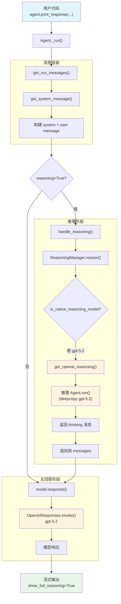

# basic_reasoning.py — 实现原理分析

> 源文件：`cookbook/02_agents/13_reasoning/basic_reasoning.py`

## 概述

本示例展示 Agno 的 **`reasoning`（原生推理）** 机制：通过设置 `reasoning=True`，在主模型调用前插入一个独立的推理阶段，让模型先对问题进行深度思考，再生成最终回答。当推理模型是原生推理模型（如 GPT-5.2）时，直接利用模型内置的推理能力（native reasoning），而非手动 Chain-of-Thought。

**核心配置一览：**

| 配置项 | 值 | 说明 |
|--------|------|------|
| `name` | `"Reasoning Agent"` | Agent 名称 |
| `model` | `OpenAIResponses(id="gpt-5.2")` | Responses API，原生推理模型 |
| `reasoning` | `True` | 启用推理阶段 |
| `reasoning_model` | `None`（未设置） | 未设置时 deepcopy 主模型作为推理模型 |
| `reasoning_min_steps` | `2` | 最少推理步骤 |
| `reasoning_max_steps` | `6` | 最多推理步骤 |
| `reasoning_agent` | `None`（未设置） | 未自定义推理 Agent |
| `markdown` | `False`（默认） | 未启用 markdown |
| `instructions` | `None`（未设置） | 无自定义指令 |
| `tools` | `None`（未设置） | 无工具 |

## 架构分层

```
用户代码层                    agno.agent 层
┌──────────────────────┐    ┌──────────────────────────────────────────┐
│ basic_reasoning.py   │    │ Agent._run()                             │
│                      │    │  ├ _messages.py                          │
│ reasoning=True       │    │  │  get_system_message()                 │
│ reasoning_min_steps=2│───>│  │    → build_context（无自定义指令）     │
│ reasoning_max_steps=6│    │  │                                        │
│ model=gpt-5.2        │    │  │  get_run_messages()                   │
│                      │    │  │    → system + user message             │
│                      │    │  │                                        │
│                      │    │  ├ _response.py                          │
│                      │    │  │  handle_reasoning()                   │
│                      │    │  │    → ReasoningManager.reason()         │
│                      │    │  │      → 检测原生推理模型 ✓              │
│                      │    │  │      → get_openai_reasoning()          │
│                      │    │  │      → 推理结果追加到 messages         │
│                      │    │  │                                        │
│                      │    │  └ model.response()                      │
│                      │    │      → 基于推理结果生成最终回答           │
└──────────────────────┘    └──────────────────────────────────────────┘
                                    │               │
                                    ▼               ▼
                            ┌──────────────┐ ┌──────────────┐
                            │ 推理阶段     │ │ 主回答阶段   │
                            │ gpt-5.2      │ │ gpt-5.2      │
                            │ (deepcopy)   │ │ (原始模型)   │
                            └──────────────┘ └──────────────┘
```

## 核心组件解析

### 1. reasoning 属性与模型检测

Agent 类定义了推理相关的五个属性（`agent.py:182-188`）：

```python
# --- Agent Reasoning ---
# 启用推理（逐步分析问题）
reasoning: bool = False
reasoning_model: Optional[Model] = None      # 可选的独立推理模型
reasoning_agent: Optional[Agent] = None       # 可选的自定义推理 Agent
reasoning_min_steps: int = 1                  # 最少步骤数
reasoning_max_steps: int = 10                 # 最多步骤数
```

本文件设置 `reasoning=True` 但未设置 `reasoning_model`，因此 `reason()` 函数会 deepcopy 主模型（`_response.py:264-267`）：

```python
reasoning_model: Optional[Model] = agent.reasoning_model
if reasoning_model is None and agent.model is not None:
    from copy import deepcopy
    reasoning_model = deepcopy(agent.model)
```

### 2. 原生推理模型检测

`ReasoningManager._detect_model_type()` 检测模型是否为原生推理模型（`reasoning/manager.py:123-150`）。对于 OpenAI 模型，检测逻辑在 `reasoning/openai.py:14-30`：

```python
def is_openai_reasoning_model(reasoning_model: Model) -> bool:
    return (
        (
            reasoning_model.__class__.__name__ == "OpenAIChat"
            or reasoning_model.__class__.__name__ == "OpenAIResponses"
            or reasoning_model.__class__.__name__ == "AzureOpenAI"
        )
        and (
            ("o4" in reasoning_model.id)
            or ("o3" in reasoning_model.id)
            or ("o1" in reasoning_model.id)
            or ("4.1" in reasoning_model.id)
            or ("4.5" in reasoning_model.id)
            or ("5.1" in reasoning_model.id)
            or ("5.2" in reasoning_model.id)  # ← gpt-5.2 匹配此条件
        )
    ) or (isinstance(reasoning_model, OpenAILike) and "deepseek-r1" in reasoning_model.id.lower())
```

`gpt-5.2` 是 `OpenAIResponses` 类且 ID 包含 `"5.2"`，因此被识别为原生推理模型。

### 3. 原生推理执行流程

`ReasoningManager.reason()` 是统一推理入口（`reasoning/manager.py:1012-1055`）：

```python
def reason(self, run_messages, stream=False):
    reasoning_model = self.config.reasoning_model
    # 发出 started 事件
    yield ReasoningEvent(event_type=ReasoningEventType.started)

    # 原生推理模型走 native 路径
    if reasoning_model_provided and self.is_native_reasoning_model(reasoning_model):
        if stream:
            yield from self._stream_native_reasoning_events(reasoning_model, run_messages)
        else:
            yield from self._get_native_reasoning_events(reasoning_model, run_messages)
    else:
        # 非原生模型走默认 CoT 路径
        yield from self._run_default_reasoning_events(reasoning_model, run_messages)
```

原生 OpenAI 推理的具体实现（`reasoning/openai.py:33-69`）：

```python
def get_openai_reasoning(reasoning_agent, messages, run_metrics=None):
    # 将 developer role 转回 system（推理 Agent 内部使用标准 role）
    for message in messages:
        if message.role == "developer":
            message.role = "system"

    # 调用推理 Agent 执行推理
    reasoning_agent_response = reasoning_agent.run(input=messages)

    # 提取推理内容（可能包含 <think> 标签）
    reasoning_content = reasoning_agent_response.content

    # 返回包装为 <thinking> 标签的推理消息
    return Message(
        role="assistant",
        content=f"<thinking>\n{reasoning_content}\n</thinking>",
        reasoning_content=reasoning_content
    )
```

### 4. 推理结果注入消息流

推理完成后，`_get_native_reasoning_events()` 将推理消息追加到 `run_messages.messages`（`reasoning/manager.py:1146-1147`）：

```python
if result.message:
    run_messages.messages.append(result.message)  # 推理消息插入消息列表
```

这样主模型在后续的 `model.response()` 调用时，消息列表中已包含推理内容，模型可以基于推理结果生成更准确的最终回答。

### 5. show_full_reasoning 显示控制

`print_response()` 支持 `show_full_reasoning=True` 参数（`_cli.py:55`），控制是否在终端输出完整推理过程。流式模式下通过 `stream_events=True` 传播推理事件，最终在终端渲染推理步骤内容。

## System Prompt 组装

| 序号 | 组成部分 | 本文件中的值/来源 | 是否生效 |
|------|---------|-----------------|---------|
| 1 | `system_message`（自定义） | `None` | 否 |
| 3.1 | `instructions` | `None` | 否 |
| 3.1.1 | 模型指令（`get_instructions_for_model`） | OpenAIResponses 默认 | 视模型实现 |
| 3.2.1 | `markdown` | `False` | 否 |
| 3.2.2 | `add_datetime_to_context` | `False` | 否 |
| 3.2.3 | `add_location_to_context` | `False` | 否 |
| 3.2.4 | `add_name_to_context` | `False` | 否 |
| 3.3.1 | `description` | `None` | 否 |
| 3.3.2 | `role` | `None` | 否 |
| 3.3.3 | instructions 拼接 | 无 | 否 |
| 3.3.4 | additional_information | 无 | 否 |
| 3.3.5 | `_tool_instructions` | `None` | 否 |
| fmt | `resolve_in_context` 变量替换 | `True`（默认） | 无模板变量 |
| 3.3.7 | `expected_output` | `None` | 否 |
| 3.3.8 | `additional_context` | `None` | 否 |
| 3.3.9 | `add_memories_to_context` | `None` | 否 |
| 3.3.10 | `add_culture_to_context` | `None` | 否 |
| 3.3.11 | `add_session_summary_to_context` | `None` | 否 |
| 3.3.12 | `add_learnings_to_context` | `True`（默认），无 learning | 否 |
| 3.3.13 | `search_knowledge` instructions | 无 knowledge | 否 |
| 3.3.14 | 模型 system message | 视模型实现 | 视模型 |
| 3.3.15 | JSON output prompt | `None` | 否 |
| 3.3.16 | response model format prompt | `None` | 否 |
| 3.3.17 | `add_session_state_to_context` | `False` | 否 |

> 本示例无自定义指令、无工具、无知识库，system prompt 内容极简（可能为空或仅含模型级默认指令）。

### 最终 System Prompt

```text
（可能为空或仅含模型级默认内容，因未设置任何 description/instructions/context 参数）
```

## 完整 API 请求

本示例涉及两次 API 调用：推理阶段和主回答阶段。

### 第一轮：推理阶段（由 ReasoningManager 触发）

推理 Agent 内部调用（`reasoning/openai.py` 将 developer→system）：

```python
# 推理 Agent 内部调用（deepcopy 的 gpt-5.2）
client.responses.create(
    model="gpt-5.2",
    input=[
        # 系统消息（如有，从原始消息中提取并转为 system role）
        # 用户消息
        {"role": "user", "content": "A bat and ball cost $1.10 total. The bat costs $1.00 more than the ball. How much does the ball cost?"}
    ],
    stream=True,
    stream_options={"include_usage": True}
)
```

推理结果被封装为 `<thinking>` 标签消息追加到消息列表。

### 第二轮：主回答阶段

```python
client.responses.create(
    model="gpt-5.2",
    input=[
        # 1. System Message（如有）
        # {"role": "developer", "content": "..."},

        # 2. 推理结果（由推理阶段注入）
        {"role": "assistant", "content": "<thinking>\n...(推理过程)...\n</thinking>"},

        # 3. 当前用户输入
        {"role": "user", "content": "A bat and ball cost $1.10 total. The bat costs $1.00 more than the ball. How much does the ball cost?"}
    ],
    stream=True,
    stream_options={"include_usage": True}
)
```

> **说明**：推理阶段的结果以 `<thinking>` 标签包裹的 assistant 消息注入消息列表，主模型可以据此生成更精确的最终回答。两次调用使用相同模型（`gpt-5.2`），但推理 Agent 是主模型的 deepcopy 独立实例。

## Mermaid 流程图



## 关键源码文件索引

| 文件 | 关键函数/类 | 作用 |
|------|------------|------|
| `agno/agent/agent.py` | `reasoning` L184 | 推理开关 |
| `agno/agent/agent.py` | `reasoning_model` L185 | 推理模型（可选） |
| `agno/agent/agent.py` | `reasoning_min_steps` L187 | 最少推理步骤 |
| `agno/agent/agent.py` | `reasoning_max_steps` L188 | 最多推理步骤 |
| `agno/agent/_run.py` | `handle_reasoning()` L493 | 推理阶段调用入口 |
| `agno/agent/_response.py` | `handle_reasoning()` L70 | 同步推理处理 |
| `agno/agent/_response.py` | `reason()` L247 | 创建 ReasoningManager 并执行推理 |
| `agno/reasoning/manager.py` | `ReasoningConfig` L78 | 推理配置 dataclass |
| `agno/reasoning/manager.py` | `ReasoningManager` L106 | 推理管理器核心类 |
| `agno/reasoning/manager.py` | `_detect_model_type()` L123 | 检测原生推理模型类型 |
| `agno/reasoning/manager.py` | `reason()` L1012 | 统一推理入口 |
| `agno/reasoning/openai.py` | `is_openai_reasoning_model()` L14 | 判断是否为 OpenAI 原生推理模型 |
| `agno/reasoning/openai.py` | `get_openai_reasoning()` L33 | OpenAI 原生推理执行 |
| `agno/reasoning/step.py` | `ReasoningStep` L14 | 推理步骤 Pydantic 模型 |
| `agno/reasoning/step.py` | `NextAction` L7 | 下一步动作枚举 |
| `agno/reasoning/helpers.py` | `get_reasoning_agent()` L11 | 创建原生推理 Agent |
| `agno/reasoning/helpers.py` | `update_messages_with_reasoning()` L42 | 将推理消息注入消息流 |
| `agno/agent/_cli.py` | `show_full_reasoning` L55 | 控制推理过程显示 |
