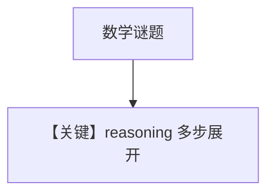

# basic_reasoning.py — 实现原理分析

> 源文件：`cookbook/02_agents/13_reasoning/basic_reasoning.py`

## 概述

本示例展示 **原生 `reasoning=True` 步数约束**：同一 `OpenAIResponses` 模型上设 `reasoning_min_steps`/`reasoning_max_steps`，`print_response(..., show_full_reasoning=True)` 展示球拍定价类脑筋急转弯的推理轨迹。

**核心配置一览：**

| 配置项 | 值 |
|--------|-----|
| `reasoning` | `True` |
| `reasoning_min_steps` | `2` |
| `reasoning_max_steps` | `6` |
| `model` | `OpenAIResponses(id="gpt-5.2")` |

## 运行机制与因果链

框架在 Responses API 上打开 **reasoning 相关参数**（与 `OpenAIResponses._set_reasoning_request_param` 等一致）。

## Mermaid 流程图

```mermaid
flowchart TD
    Q["数学谜题"] --> R["【关键】reasoning 多步展开"]
```

## 关键源码文件索引

| 文件 | 作用 |
|------|------|
| `agno/models/openai/responses.py` | `reasoning` / `reasoning_effort` |
| `agno/agent` | `show_full_reasoning` |
