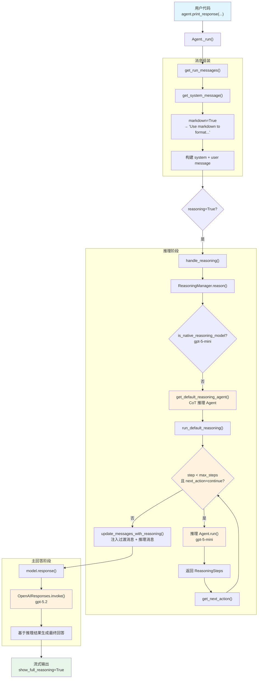

# reasoning_with_model.py — 实现原理分析

> 源文件：`cookbook/02_agents/13_reasoning/reasoning_with_model.py`

## 概述

本示例展示 Agno 的 **`reasoning_model`（分离推理模型）** 机制：通过设置独立的 `reasoning_model` 参数，将推理阶段交给一个更轻量/专用的模型（`gpt-5-mini`），而主回答阶段仍使用高性能模型（`gpt-5.2`）。当 `reasoning_model` 不是原生推理模型时，Agno 自动退化为 **默认 Chain-of-Thought（CoT）推理** —— 创建一个内置推理 Agent，使用结构化输出（`ReasoningSteps`）逐步分析问题。

**核心配置一览：**

| 配置项 | 值 | 说明 |
|--------|------|------|
| `name` | `None`（未设置） | 未命名 Agent |
| `model` | `OpenAIResponses(id="gpt-5.2")` | 主模型，Responses API |
| `reasoning_model` | `OpenAIResponses(id="gpt-5-mini")` | 推理模型，非原生推理模型 |
| `reasoning` | `True` | 启用推理阶段 |
| `reasoning_min_steps` | `2` | 最少推理步骤 |
| `reasoning_max_steps` | `5` | 最多推理步骤 |
| `reasoning_agent` | `None`（未设置） | 由框架自动创建默认 CoT Agent |
| `markdown` | `True` | 启用 markdown 格式化 |
| `instructions` | `None`（未设置） | 无自定义指令 |
| `tools` | `None`（未设置） | 无工具 |

## 架构分层

```
用户代码层                    agno.agent 层
┌──────────────────────┐    ┌──────────────────────────────────────────┐
│reasoning_with_model.py│   │ Agent._run()                             │
│                      │    │  ├ _messages.py                          │
│ model=gpt-5.2        │    │  │  get_system_message()                 │
│ reasoning_model=     │───>│  │    → markdown 指令                    │
│   gpt-5-mini         │    │  │  get_run_messages()                   │
│ reasoning=True       │    │  │    → system + user message             │
│ min_steps=2          │    │  │                                        │
│ max_steps=5          │    │  ├ _response.py                          │
│ markdown=True        │    │  │  handle_reasoning()                   │
│                      │    │  │    → ReasoningManager.reason()         │
│                      │    │  │      → 非原生推理 → 默认 CoT          │
│                      │    │  │      → get_default_reasoning_agent()   │
│                      │    │  │      → 循环执行推理步骤                │
│                      │    │  │      → update_messages_with_reasoning()│
│                      │    │  │                                        │
│                      │    │  └ model.response()                      │
│                      │    │      → 基于推理结果生成最终回答           │
└──────────────────────┘    └──────────────────────────────────────────┘
                                    │               │
                                    ▼               ▼
                            ┌──────────────┐ ┌──────────────┐
                            │ 推理阶段     │ │ 主回答阶段   │
                            │ gpt-5-mini   │ │ gpt-5.2      │
                            │ (CoT Agent)  │ │ (主模型)     │
                            └──────────────┘ └──────────────┘
```

## 核心组件解析

### 1. 原生推理 vs 默认 CoT 推理

`reasoning_model=OpenAIResponses(id="gpt-5-mini")` 不满足原生推理模型检测条件。检测逻辑（`reasoning/openai.py:14-30`）要求模型 ID 包含 `"o4"`, `"o3"`, `"o1"`, `"4.1"`, `"4.5"`, `"5.1"`, `"5.2"` 之一，而 `"gpt-5-mini"` 均不匹配。

`ReasoningManager.reason()` 中的分支逻辑（`reasoning/manager.py:1048-1055`）：

```python
# 原生推理模型走 native 路径
if reasoning_model_provided and self.is_native_reasoning_model(reasoning_model):
    # ... native reasoning
else:
    # 非原生模型 → 默认 CoT 推理
    if reasoning_model_provided:
        log_info(
            f"Reasoning model: {reasoning_model.__class__.__name__} is not a native reasoning model, "
            "defaulting to manual Chain-of-Thought reasoning"
        )
    yield from self._run_default_reasoning_events(reasoning_model, run_messages)
```

### 2. 默认 CoT 推理 Agent 创建

`get_default_reasoning_agent()` 创建一个专用推理 Agent（`reasoning/default.py:13-96`）：

```python
def get_default_reasoning_agent(reasoning_model, min_steps, max_steps, ...):
    agent = Agent(
        model=reasoning_model,                    # gpt-5-mini
        description="You are a meticulous, thoughtful, and logical Reasoning Agent...",
        instructions=dedent(f"""\
        Step 1 - Problem Analysis:
        - Restate the user's task clearly...

        Step 2 - Decompose and Strategize:
        - Break down the problem...

        Step 3 - Intent Clarification and Planning:
        - Clearly articulate the user's intent...

        Step 4 - Execute the Action Plan:
        For each planned step, document:
        1. **Title**: ...
        2. **Action**: ...
        3. **Result**: ...
        4. **Reasoning**: ...
        5. **Next Action**: continue / validate / final_answer / reset
        6. **Confidence Score**: 0.0–1.0

        Step 5 - Validation (mandatory before finalizing):
        - Cross-verify with alternative approaches...

        Step 6 - Provide the Final Answer:
        - Once validated and confident...

        - Adhere strictly to a minimum of {min_steps} and maximum of {max_steps} steps...
        """),
        output_schema=ReasoningSteps,  # 结构化输出：强制返回 ReasoningSteps 格式
        tools=tools,                   # 传递主 Agent 的工具（本例为 None）
    )
    return agent
```

关键点：
- 推理 Agent 使用 `output_schema=ReasoningSteps` 强制结构化输出
- 指令中嵌入了 `min_steps` 和 `max_steps` 参数
- 推理 Agent 继承主 Agent 的 `session_state`、`dependencies`、`metadata`

### 3. CoT 推理循环

`run_default_reasoning()` 执行迭代推理（`reasoning/manager.py:790-900`）：

```python
step_count = 1
next_action = NextAction.CONTINUE
all_reasoning_steps: List[ReasoningStep] = []

while next_action == NextAction.CONTINUE and step_count < self.config.max_steps:
    # 调用推理 Agent（gpt-5-mini），输入为当前消息
    reasoning_agent_response = reasoning_agent.run(input=run_messages.get_input_messages())

    # 提取结构化推理步骤
    reasoning_steps = reasoning_agent_response.content.reasoning_steps
    all_reasoning_steps.extend(reasoning_steps)

    # 逐个 yield 推理步骤
    for step in reasoning_steps:
        yield (step, None)

    # 提取推理消息（assistant 消息之后的所有消息）
    reasoning_messages = reasoning_agent_response.messages[first_assistant_index:]

    # 根据最后一个步骤的 next_action 决定是否继续
    next_action = get_next_action(reasoning_steps[-1])
    if next_action == NextAction.FINAL_ANSWER:
        break

    step_count += 1
```

循环终止条件（满足任一即停止）：
- `next_action == NextAction.FINAL_ANSWER`（推理 Agent 认为已得出结论）
- `step_count >= max_steps`（达到最大步骤限制，本例为 5）

### 4. 推理结果注入消息流

推理完成后，`update_messages_with_reasoning()` 将推理过程注入主 Agent 的消息列表（`reasoning/helpers.py:42-62`）：

```python
def update_messages_with_reasoning(run_messages, reasoning_messages):
    # 插入过渡消息 1：表明已完成深度分析
    run_messages.messages.append(
        Message(
            role="assistant",
            content="I have worked through this problem in-depth, running all necessary tools...",
            add_to_agent_memory=False,  # 不持久化到记忆
        )
    )
    # 插入推理 Agent 的所有消息
    for message in reasoning_messages:
        message.add_to_agent_memory = False
    run_messages.messages.extend(reasoning_messages)
    # 插入过渡消息 2：指示主模型总结推理并给出最终答案
    run_messages.messages.append(
        Message(
            role="assistant",
            content="Now I will summarize my reasoning and provide a final answer...",
            add_to_agent_memory=False,
        )
    )
```

关键设计：
- 所有推理消息标记 `add_to_agent_memory=False`，不会被持久化
- 两条过渡消息引导主模型基于推理结果生成最终回答

### 5. ReasoningStep 结构

推理步骤的数据模型（`reasoning/step.py:14-28`）：

```python
class ReasoningStep(BaseModel):
    title: Optional[str]        # 步骤标题
    action: Optional[str]       # 执行的动作
    result: Optional[str]       # 动作结果
    reasoning: Optional[str]    # 推理过程
    next_action: Optional[NextAction]  # 下一步：continue/validate/final_answer/reset
    confidence: Optional[float] # 置信度 0.0-1.0
```

### 6. basic_reasoning vs reasoning_with_model 对比

| 维度 | basic_reasoning | reasoning_with_model |
|------|----------------|---------------------|
| 推理模型 | deepcopy(gpt-5.2) | gpt-5-mini（独立指定） |
| 推理路径 | 原生推理（native） | 默认 CoT（手动迭代） |
| 推理结果格式 | `<thinking>` 标签包裹 | 结构化 `ReasoningSteps` + 过渡消息 |
| 推理步骤控制 | 由模型内部控制 | `min_steps=2, max_steps=5` 严格限制 |
| 推理消息注入 | 单条 thinking 消息 | 多条过渡消息 + 推理消息 |
| 成本 | 两次调用同模型 | 推理用轻量模型，回答用高性能模型 |

## System Prompt 组装

| 序号 | 组成部分 | 本文件中的值/来源 | 是否生效 |
|------|---------|-----------------|---------|
| 1 | `system_message`（自定义） | `None` | 否 |
| 3.1 | `instructions` | `None` | 否 |
| 3.1.1 | 模型指令（`get_instructions_for_model`） | OpenAIResponses 默认 | 视模型实现 |
| 3.2.1 | `markdown` | `True` | **是** |
| 3.2.2 | `add_datetime_to_context` | `False` | 否 |
| 3.2.3 | `add_location_to_context` | `False` | 否 |
| 3.2.4 | `add_name_to_context` | `False` | 否 |
| 3.3.1 | `description` | `None` | 否 |
| 3.3.2 | `role` | `None` | 否 |
| 3.3.3 | instructions 拼接 | 无 | 否 |
| 3.3.4 | additional_information | markdown 指令 | **是** |
| 3.3.5 | `_tool_instructions` | `None` | 否 |
| fmt | `resolve_in_context` 变量替换 | `True`（默认） | 无模板变量 |
| 3.3.7 | `expected_output` | `None` | 否 |
| 3.3.8 | `additional_context` | `None` | 否 |
| 3.3.9 | `add_memories_to_context` | `None` | 否 |
| 3.3.10 | `add_culture_to_context` | `None` | 否 |
| 3.3.11 | `add_session_summary_to_context` | `None` | 否 |
| 3.3.12 | `add_learnings_to_context` | `True`（默认），无 learning | 否 |
| 3.3.13 | `search_knowledge` instructions | 无 knowledge | 否 |
| 3.3.14 | 模型 system message | 视模型实现 | 视模型 |
| 3.3.15 | JSON output prompt | `None` | 否 |
| 3.3.16 | response model format prompt | `None` | 否 |
| 3.3.17 | `add_session_state_to_context` | `False` | 否 |

### 最终 System Prompt

```text
<additional_information>
- Use markdown to format your answers.
</additional_information>
```

## 完整 API 请求

本示例涉及三阶段调用：推理 Agent 循环（可能多轮） → 主模型回答。

### 第一阶段：推理 Agent 调用（CoT 循环，使用 gpt-5-mini）

推理 Agent 是由 `get_default_reasoning_agent()` 创建的独立 Agent，拥有自己的 system prompt（包含详细的推理指令）和 `output_schema=ReasoningSteps`。

```python
# 推理 Agent 内部调用（每轮循环）
client.responses.create(
    model="gpt-5-mini",
    input=[
        # 1. 推理 Agent 的 System Message（包含详细的 6 步推理指令）
        {"role": "developer", "content": "You are a meticulous, thoughtful, and logical Reasoning Agent...\n\nStep 1 - Problem Analysis:\n...\nStep 6 - Provide the Final Answer:\n...\nAdhere strictly to a minimum of 2 and maximum of 5 steps..."},

        # 2. 主 Agent 的当前消息（作为推理输入）
        # 包括 system message + user message
        {"role": "developer", "content": "<additional_information>\n- Use markdown to format your answers.\n</additional_information>\n"},
        {"role": "user", "content": "A farmer has 17 sheep. All but 9 die. How many sheep are left?"}
    ],
    # 结构化输出（ReasoningSteps schema）
    text={"format": {"type": "json_schema", "...": "ReasoningSteps schema"}},
    stream=True,
    stream_options={"include_usage": True}
)
```

推理 Agent 返回结构化 `ReasoningSteps`，例如：

```json
{
  "reasoning_steps": [
    {
      "title": "Problem Analysis",
      "reasoning": "The farmer starts with 17 sheep. 'All but 9 die' means 9 survive.",
      "action": "I will interpret the statement literally.",
      "next_action": "final_answer",
      "confidence": 0.99
    }
  ]
}
```

如果 `next_action` 为 `"continue"`，推理 Agent 会被再次调用（同样的输入），直到返回 `"final_answer"` 或达到 `max_steps=5`。

### 第二阶段：推理结果注入

推理完成后，消息列表变为：

```
[system_message, 过渡消息1, 推理消息..., 过渡消息2, user_message]
```

### 第三阶段：主模型调用（gpt-5.2）

```python
client.responses.create(
    model="gpt-5.2",
    input=[
        # 1. System Message
        {"role": "developer", "content": "<additional_information>\n- Use markdown to format your answers.\n</additional_information>\n"},

        # 2. 过渡消息 1（来自推理注入）
        {"role": "assistant", "content": "I have worked through this problem in-depth, running all necessary tools and have included my raw, step by step research. "},

        # 3. 推理 Agent 的响应消息
        {"role": "assistant", "content": "{\"reasoning_steps\": [{\"title\": \"Problem Analysis\", ...}]}"},

        # 4. 过渡消息 2
        {"role": "assistant", "content": "Now I will summarize my reasoning and provide a final answer. I will skip any tool calls already executed and steps that are not relevant to the final answer."},

        # 5. 当前用户输入
        {"role": "user", "content": "A farmer has 17 sheep. All but 9 die. How many sheep are left?"}
    ],
    stream=True,
    stream_options={"include_usage": True}
)
```

> **说明**：推理阶段使用轻量模型 `gpt-5-mini` 降低成本，主回答阶段使用 `gpt-5.2` 保证质量。推理消息通过两条过渡消息引导主模型基于推理结果生成最终回答，且所有推理消息标记为 `add_to_agent_memory=False` 不会被持久化。

## Mermaid 流程图



## 关键源码文件索引

| 文件 | 关键函数/类 | 作用 |
|------|------------|------|
| `agno/agent/agent.py` | `reasoning` L184 | 推理开关 |
| `agno/agent/agent.py` | `reasoning_model` L185 | 独立推理模型 |
| `agno/agent/agent.py` | `reasoning_min_steps` L187 | 最少推理步骤 |
| `agno/agent/agent.py` | `reasoning_max_steps` L188 | 最多推理步骤 |
| `agno/agent/_run.py` | `handle_reasoning()` L493 | 推理阶段调用入口 |
| `agno/agent/_response.py` | `reason()` L247 | 创建 ReasoningManager 并执行推理 |
| `agno/reasoning/manager.py` | `ReasoningManager` L106 | 推理管理器核心类 |
| `agno/reasoning/manager.py` | `reason()` L1012 | 统一推理入口（native vs CoT 分支） |
| `agno/reasoning/manager.py` | `run_default_reasoning()` L790 | 默认 CoT 推理循环 |
| `agno/reasoning/manager.py` | `_get_default_reasoning_agent()` L167 | 获取/创建默认 CoT Agent |
| `agno/reasoning/openai.py` | `is_openai_reasoning_model()` L14 | 原生推理模型检测（gpt-5-mini 不匹配） |
| `agno/reasoning/default.py` | `get_default_reasoning_agent()` L13 | 创建默认推理 Agent（含 6 步指令 + ReasoningSteps schema） |
| `agno/reasoning/step.py` | `ReasoningStep` L14 | 推理步骤数据模型 |
| `agno/reasoning/step.py` | `ReasoningSteps` L30 | 推理步骤列表模型（output_schema） |
| `agno/reasoning/step.py` | `NextAction` L7 | 下一步动作枚举（continue/validate/final_answer/reset） |
| `agno/reasoning/helpers.py` | `get_next_action()` L31 | 从推理步骤提取下一步动作 |
| `agno/reasoning/helpers.py` | `update_messages_with_reasoning()` L42 | 将推理消息注入主 Agent 消息流 |
| `agno/agent/_cli.py` | `show_full_reasoning` L55 | 控制推理过程显示 |
