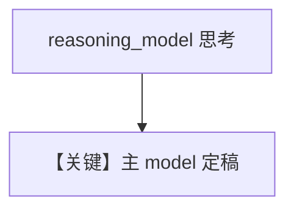

# reasoning_with_model.py — 实现原理分析

> 源文件：`cookbook/02_agents/13_reasoning/reasoning_with_model.py`

## 概述

本示例展示 **主模型与 `reasoning_model` 分离**：主模型 `gpt-5.2` 负责最终回答，`reasoning_model=gpt-5-mini` 承担思考步骤；同样 `reasoning_min/max_steps` 与 `show_full_reasoning`。

**核心配置一览：**

| 配置项 | 值 |
|--------|-----|
| `model` | `OpenAIResponses(id="gpt-5.2")` |
| `reasoning_model` | `OpenAIResponses(id="gpt-5-mini")` |
| `reasoning` | `True` |
| `markdown` | `True` |

## 运行机制与因果链

成本/延迟拆分：小模型做推理草稿，大模型润色输出（具体调度见 `_run` 推理分支）。

参照用户句：羊只数量谜题（`.py` 字面量）。

## Mermaid 流程图

```mermaid
flowchart TD
    RM["reasoning_model 思考"] --> M["【关键】主 model 定稿"]
```

## 关键源码文件索引

| 文件 | 作用 |
|------|------|
| `agno/agent/agent.py` | `reasoning_model` 属性 |
