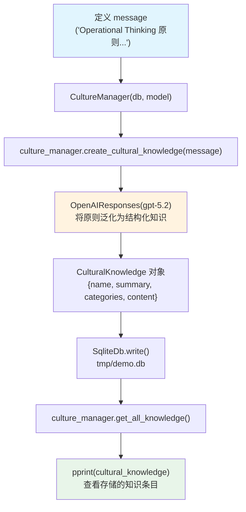

# 01_create_cultural_knowledge.py — 实现原理分析

> 源文件：`cookbook/02_agents/14_advanced/01_create_cultural_knowledge.py`

## 概述

本示例展示 Agno 的 **文化知识创建**机制：使用 `CultureManager` 将可复用的行为准则、原则或洞察通过 LLM 泛化为结构化文化知识条目，持久化到 SQLite，供后续 Agent 加载使用（第2步：`02_use_cultural_knowledge_in_agent.py`）。

**核心配置一览：**

| 配置项 | 值 | 说明 |
|--------|------|------|
| `CultureManager.db` | `SqliteDb(db_file="tmp/demo.db")` | 文化知识持久化 |
| `CultureManager.model` | `OpenAIResponses(id="gpt-5.2")` | 用于泛化消息为知识条目 |
| Agent 相关 | 无（本示例不创建 Agent） | 仅操作 CultureManager |

## 架构分层

```
用户代码层                      agno.culture 层
┌──────────────────────────┐  ┌──────────────────────────────────────┐
│ 01_create_cultural_      │  │ CultureManager                        │
│ knowledge.py             │  │  ├─ create_cultural_knowledge(message)│
│                          │  │  │   └─ model.invoke() 泛化消息       │
│ culture_manager.create_  │─>│  │   → 生成结构化 CulturalKnowledge  │
│ cultural_knowledge(msg)  │  │  │   → 写入 db                       │
│                          │  │  └─ get_all_knowledge()              │
│ culture_manager.get_all_ │  │      └─ 从 db 读取所有知识条目       │
│ knowledge()              │  └──────────────────────────────────────┘
└──────────────────────────┘               │
                                           ▼
                                ┌──────────────────────┐
                                │ OpenAIResponses      │
                                │ gpt-5.2              │
                                └──────────────────────┘
                                           │
                                           ▼
                                ┌──────────────────────┐
                                │ SqliteDb             │
                                │ tmp/demo.db          │
                                └──────────────────────┘
```

## 核心组件解析

### CultureManager

```python
from agno.culture.manager import CultureManager

culture_manager = CultureManager(
    db=SqliteDb(db_file="tmp/demo.db"),       # 存储后端
    model=OpenAIResponses(id="gpt-5.2"),      # 泛化模型（可选，手动添加时不需要）
)

# 从消息创建文化知识（LLM 泛化为结构化条目）
culture_manager.create_cultural_knowledge(message=message)

# 获取所有知识条目
cultural_knowledge = culture_manager.get_all_knowledge()
```

### 文化知识条目结构

`create_cultural_knowledge()` 调用 LLM 将原始消息泛化为 `CulturalKnowledge` 对象：

```python
# CulturalKnowledge 字段（内部结构）
{
    "name": "Operational Thinking Framework",
    "summary": "...",
    "categories": ["engineering", "communication"],
    "content": "...",
    "notes": [...],
    "metadata": {...}
}
```

### 工作流程

1. 调用 `create_cultural_knowledge(message)` → LLM 读取消息并泛化
2. 结构化知识存入 `SqliteDb`
3. 后续步骤（`02_use_cultural_knowledge_in_agent.py`）通过 `add_culture_to_context=True` 自动加载

## Mermaid 流程图



## 关键源码文件索引

| 文件 | 关键函数/类 | 作用 |
|------|------------|------|
| `agno/culture/manager.py` | `CultureManager` | 文化知识管理器 |
| `agno/culture/manager.py` | `create_cultural_knowledge()` | LLM 泛化为知识条目 |
| `agno/culture/manager.py` | `get_all_knowledge()` | 查询所有知识 |
| `agno/db/schemas/culture.py` | `CulturalKnowledge` | 知识条目数据模型 |
