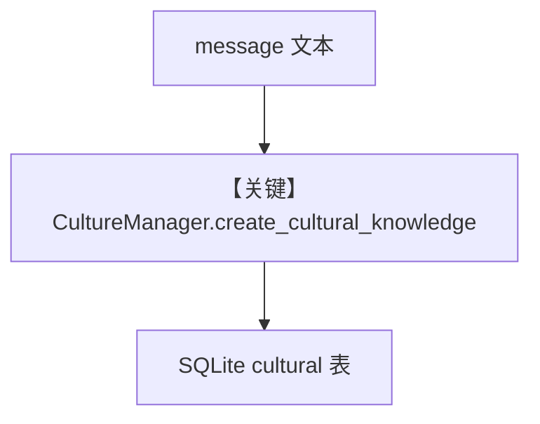

# 01_create_cultural_knowledge.py — 实现原理分析

> 源文件：`cookbook/02_agents/14_advanced/01_create_cultural_knowledge.py`

## 概述

本示例展示 **CultureManager 从自然语言提炼文化知识**：`CultureManager(db, model)` 调用 `create_cultural_knowledge(message=...)`，把长段「Operational Thinking」原则写入共享层，供后续 Agent 通过 `add_culture_to_context` 消费。

**核心配置：** `SqliteDb("tmp/demo.db")`；`OpenAIResponses(id="gpt-5.2")`。

## 运行机制与因果链

无 Agent run；纯 **管理 API** 写库。`message` 字面量见 `.py` L41–51。

## Mermaid 流程图

```mermaid
flowchart TD
    M["message 文本"] --> CM["【关键】CultureManager.create_cultural_knowledge"]
    CM --> DB["SQLite cultural 表"]
```

## 关键源码文件索引

| 文件 | 作用 |
|------|------|
| `agno/culture/manager.py` | `CultureManager` |
