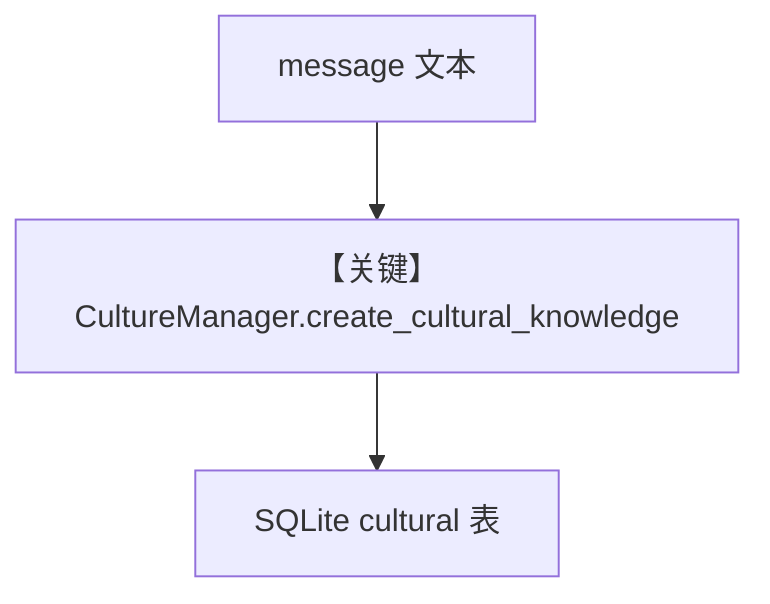

# 01_create_cultural_knowledge.py — 实现原理分析

<!-- cookbook-py-source:start -->
## 完整源码

```python
"""
01 Create Cultural Knowledge
=============================

Create cultural knowledge to use with your Agents.
"""

from agno.culture.manager import CultureManager
from agno.db.sqlite import SqliteDb
from agno.models.openai import OpenAIResponses
from rich.pretty import pprint

# ---------------------------------------------------------------------------
# Step 1. Initialize the database used for storing cultural knowledge
# ---------------------------------------------------------------------------
db = SqliteDb(db_file="tmp/demo.db")

# ---------------------------------------------------------------------------
# Step 2. Create the Culture Manager
# ---------------------------------------------------------------------------
# The CultureManager distills reusable insights into the shared cultural layer
# that your Agents can access for consistent reasoning and behavior.
culture_manager = CultureManager(
    db=db,
    model=OpenAIResponses(id="gpt-5.2"),
)

# ---------------------------------------------------------------------------
# Step 3. Create cultural knowledge from a message
# ---------------------------------------------------------------------------
# You can feed in any insight, principle, or lesson you’d like the system to remember.
# The model will generalize it into structured cultural knowledge entries.
#
# For example:
# - Communication best practices
# - Decision-making patterns
# - Design or engineering principles
#
# Try to phrase inputs as *reusable truths* or *guiding principles*,
# not one-off observations.
message = (
    "All technical guidance should follow the 'Operational Thinking' principle:\n"
    "\n"
    "1. **State the Objective** — What outcome are we trying to achieve and why.\n"
    "2. **Show the Procedure** — List clear, reproducible steps (prefer commands or configs).\n"
    "3. **Surface Pitfalls** — Mention what usually fails and how to detect it early.\n"
    "4. **Define Validation** — How to confirm it’s working (logs, tests, metrics).\n"
    "5. **Close the Loop** — Suggest next iterations or improvements.\n"
    "\n"
    "Keep answers short, structured, and directly actionable. Avoid general theory unless "
    "it informs an operational decision."
)

culture_manager.create_cultural_knowledge(message=message)

# ---------------------------------------------------------------------------
# Step 4. Retrieve and inspect the stored cultural knowledge
# ---------------------------------------------------------------------------
cultural_knowledge = culture_manager.get_all_knowledge()

# ---------------------------------------------------------------------------
# Run Agent
# ---------------------------------------------------------------------------
if __name__ == "__main__":
    print("\n=== Cultural Knowledge Entries ===")
    pprint(cultural_knowledge)
```

<!-- cookbook-py-source:end -->

> 源文件：`cookbook/02_agents/14_advanced/01_create_cultural_knowledge.py`

## 概述

本示例展示 **CultureManager 从自然语言提炼文化知识**：`CultureManager(db, model)` 调用 `create_cultural_knowledge(message=...)`，把长段「Operational Thinking」原则写入共享层，供后续 Agent 通过 `add_culture_to_context` 消费。

**核心配置：** `SqliteDb("tmp/demo.db")`；`OpenAIResponses(id="gpt-5.2")`。

## 运行机制与因果链

无 Agent run；纯 **管理 API** 写库。`message` 字面量见 `.py` L41–51。

## Mermaid 流程图


```mermaid
flowchart TD
    M["message 文本"] --> CM["【关键】CultureManager.create_cultural_knowledge"]
    CM --> DB["SQLite cultural 表"]
```

## 关键源码文件索引

| 文件 | 作用 |
|------|------|
| `agno/culture/manager.py` | `CultureManager` |
