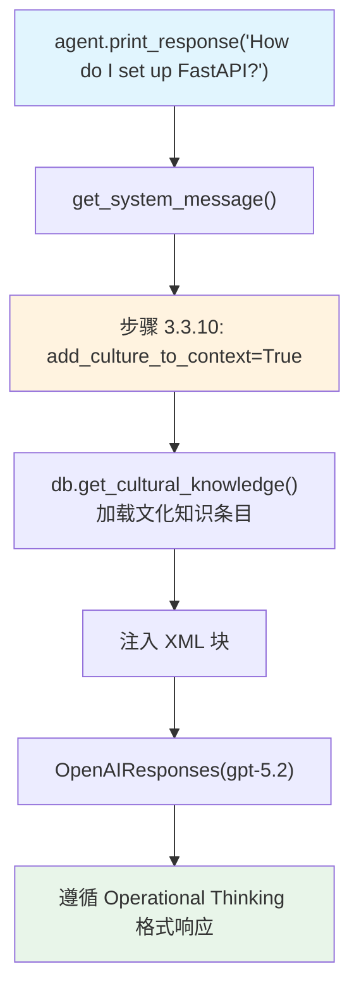

# 02_use_cultural_knowledge_in_agent.py — 实现原理分析

> 源文件：`cookbook/02_agents/14_advanced/02_use_cultural_knowledge_in_agent.py`

## 概述

本示例展示 Agno 的 **文化知识注入 Agent**机制：通过 `add_culture_to_context=True`，Agent 运行时自动从 DB 加载文化知识并注入 system prompt，影响模型的响应风格（需先运行 `01_create_cultural_knowledge.py`）。

**核心配置一览：**

| 配置项 | 值 | 说明 |
|--------|------|------|
| `model` | `OpenAIResponses(id="gpt-5.2")` | Responses API |
| `db` | `SqliteDb(db_file="tmp/demo.db")` | 同一个 DB（共享文化知识） |
| `add_culture_to_context` | `True` | 将文化知识注入 system prompt |
| `update_cultural_knowledge` | `None`（注释掉） | 不自动更新（只读取） |
| `instructions` | `None` | 未设置 |

## 架构分层

```
用户代码层                    agno.agent 层
┌──────────────────────┐    ┌──────────────────────────────────────┐
│ 02_use_cultural_     │    │ Agent._run()                          │
│ knowledge_in_agent.py│    │  ├─ get_system_message()              │
│                      │    │  │   → 步骤 3.2.1: markdown           │
│ agent.print_response │───>│  │   → 步骤 3.3.10: cultural knowledge│
│   ("How do I set up  │    │  │     └─ db.get_cultural_knowledge() │
│    FastAPI...",      │    │  │     → <cultural_knowledge>XML块    │
│    stream=True)      │    │  └─ get_run_messages()                │
│                      │    └──────────────────────────────────────┘
└──────────────────────┘                   │
                                           ▼
                              ┌──────────────────────────────┐
                              │ OpenAIResponses              │
                              │ gpt-5.2                      │
                              │ (文化知识影响响应风格)         │
                              └──────────────────────────────┘
```

## 核心组件解析

### add_culture_to_context 机制

```python
agent = Agent(
    model=OpenAIResponses(id="gpt-5.2"),
    db=db,                          # 必须与 CultureManager 共享同一 DB
    add_culture_to_context=True,    # 启用：自动加载文化知识注入 system prompt
)
```

`add_culture_to_context=True` 对应 `get_system_message()` 步骤 3.3.10，将文化知识以 XML 格式注入：

```text
<cultural_knowledge>
  <knowledge id="...">
    <name>Operational Thinking Framework</name>
    <content>
      1. State the Objective...
      2. Show the Procedure...
      ...
    </content>
  </knowledge>
</cultural_knowledge>
```

### 效果对比（A/B）

```python
# 有文化知识（本示例）
agent.print_response("How do I set up a FastAPI service using Docker?")
# → 响应遵循 "Operational Thinking" 格式：目标→步骤→陷阱→验证

# 无文化知识（注释中的对比）
# agent_no_culture = Agent(model=OpenAIResponses(id="gpt-5.2"))
# → 响应为通用格式
```

## System Prompt 组装

| 序号 | 组成部分 | 值 | 是否生效 |
|------|---------|-----|---------|
| 3.3.10 | `add_culture_to_context` | `True`，加载 DB 中的文化知识 | 是 |
| 其他 | markdown/instructions 等 | 均未设置 | 否 |

### 最终 System Prompt（示意）

```text
<cultural_knowledge>
  <knowledge id="xxx">
    <name>Operational Thinking Framework</name>
    <content>
      All technical guidance should follow...
      1. State the Objective
      2. Show the Procedure
      ...
    </content>
  </knowledge>
</cultural_knowledge>
```

## Mermaid 流程图



## 关键源码文件索引

| 文件 | 关键函数/类 | 作用 |
|------|------------|------|
| `agno/agent/agent.py` | `add_culture_to_context` L239 | 文化知识注入开关 |
| `agno/agent/_messages.py` | 步骤 3.3.10 L322-381 | 文化知识组装到 system prompt |
| `agno/culture/manager.py` | `CultureManager` | 文化知识读取 |
