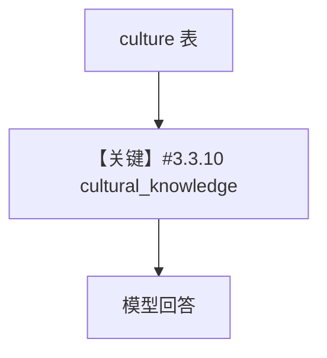

# 02_use_cultural_knowledge_in_agent.py — 实现原理分析

<!-- cookbook-py-source:start -->
## 完整源码

```python
"""
02 Use Cultural Knowledge In Agent
=============================

Use cultural knowledge with your Agents.
"""

from agno.agent import Agent
from agno.db.sqlite import SqliteDb
from agno.models.openai import OpenAIResponses

# ---------------------------------------------------------------------------
# Step 1. Initialize the database (same one used in 01_create_cultural_knowledge.py)
# ---------------------------------------------------------------------------
db = SqliteDb(db_file="tmp/demo.db")

# ---------------------------------------------------------------------------
# Create Agent
# ---------------------------------------------------------------------------
# The Agent will automatically load shared cultural knowledge (e.g., how to
# format responses, how to write tutorials, or tone/style preferences).
agent = Agent(
    model=OpenAIResponses(id="gpt-5.2"),
    db=db,
    # This flag will add the cultural knowledge to the agent's context:
    add_culture_to_context=True,
    # This flag will update cultural knowledge after every run:
    # update_cultural_knowledge=True,
)

# ---------------------------------------------------------------------------
# Run Agent
# ---------------------------------------------------------------------------
if __name__ == "__main__":
    # (Optional) Quick A/B switch to show the difference without culture:
    # agent_no_culture = Agent(model=OpenAIResponses(id="gpt-5.2"))

    # ---------------------------------------------------------------------------
    # Step 3. Ask the Agent to generate a response that benefits from culture
    # ---------------------------------------------------------------------------
    # If `01_create_cultural_knowledge.py` added principles like:
    #   "Start technical explanations with code examples and then reasoning"
    # The Agent will apply that here, starting with a concrete FastAPI example.
    print("\n=== With Culture ===\n")
    agent.print_response(
        "How do I set up a FastAPI service using Docker? ",
        stream=True,
        markdown=True,
    )

    # (Optional) Run without culture for contrast:
    # print("\n=== Without Culture ===\n")
    # agent_no_culture.print_response("How do I set up a FastAPI service using Docker?", stream=True, markdown=True)
```

<!-- cookbook-py-source:end -->

> 源文件：`cookbook/02_agents/14_advanced/02_use_cultural_knowledge_in_agent.py`

## 概述

本示例展示 **`add_culture_to_context=True`**：与 `01_` 共用 `tmp/demo.db`，在 `get_system_message` 的 `# 3.3.10` 注入 **Cultural Knowledge** 块，回答 FastAPI+Docker 问题时遵循已存储规范。

**核心配置：** `Agent(model=..., db=db, add_culture_to_context=True)`。

## System Prompt 组装

文化段为动态 DB 内容；用户问题字面量：`How do I set up a FastAPI service using Docker?`

## Mermaid 流程图


```mermaid
flowchart TD
    DB["culture 表"] --> S["【关键】#3.3.10 cultural_knowledge"]
    S --> R["模型回答"]
```

## 关键源码文件索引

| 文件 | 作用 |
|------|------|
| `agno/agent/_messages.py` | `# 3.3.10` |
