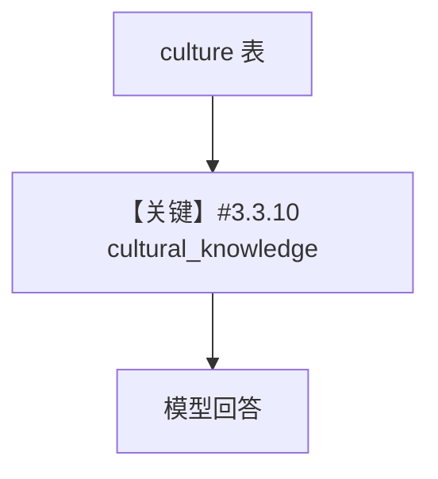

# 02_use_cultural_knowledge_in_agent.py — 实现原理分析

> 源文件：`cookbook/02_agents/14_advanced/02_use_cultural_knowledge_in_agent.py`

## 概述

本示例展示 **`add_culture_to_context=True`**：与 `01_` 共用 `tmp/demo.db`，在 `get_system_message` 的 `# 3.3.10` 注入 **Cultural Knowledge** 块，回答 FastAPI+Docker 问题时遵循已存储规范。

**核心配置：** `Agent(model=..., db=db, add_culture_to_context=True)`。

## System Prompt 组装

文化段为动态 DB 内容；用户问题字面量：`How do I set up a FastAPI service using Docker?`

## Mermaid 流程图

```mermaid
flowchart TD
    DB["culture 表"] --> S["【关键】#3.3.10 cultural_knowledge"]
    S --> R["模型回答"]
```

## 关键源码文件索引

| 文件 | 作用 |
|------|------|
| `agno/agent/_messages.py` | `# 3.3.10` |
