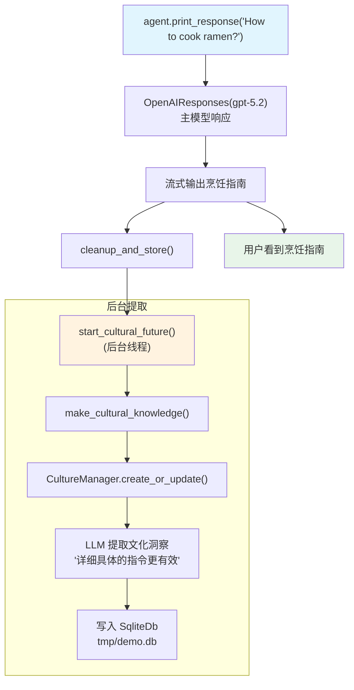

# 03_automatic_cultural_management.py — 实现原理分析

> 源文件：`cookbook/02_agents/14_advanced/03_automatic_cultural_management.py`

## 概述

本示例展示 Agno 的 **自动文化知识管理**机制：通过 `update_cultural_knowledge=True`，Agent 在每次运行结束后自动从对话内容中提取文化洞察并更新 DB，使知识库随交互自动成长，无需手动调用 CultureManager。

**核心配置一览：**

| 配置项 | 值 | 说明 |
|--------|------|------|
| `model` | `OpenAIResponses(id="gpt-5.2")` | Responses API（主模型） |
| `db` | `SqliteDb(db_file="tmp/demo.db")` | 文化知识持久化 |
| `update_cultural_knowledge` | `True` | 每次运行后自动提取文化知识 |
| `add_culture_to_context` | `None`（未设置） | 本示例不注入已有知识 |

## 架构分层

```
用户代码层                    agno.agent 层                   后台任务层
┌──────────────────────┐    ┌──────────────────────────────┐  ┌──────────────────┐
│ 03_automatic_        │    │ Agent._run()                  │  │ _managers.py     │
│ cultural_management  │    │  ├─ 主模型响应                 │  │ make_cultural_   │
│                      │───>│  └─ cleanup_and_store()       │─>│ knowledge()      │
│ agent.print_response │    │      └─ start_cultural_future │  │  └─ CultureManager│
│   ("What would be    │    │          (后台线程)            │  │     .create_or_  │
│    best way to cook  │    └──────────────────────────────┘  │     update()     │
│    ramen?")          │                                       └──────────────────┘
└──────────────────────┘                                                │
                                                                        ▼
                                                             ┌──────────────────────┐
                                                             │ OpenAIResponses      │
                                                             │ gpt-5.2（文化提取）  │
                                                             └──────────────────────┘
```

## 核心组件解析

### update_cultural_knowledge 自动提取机制

```python
agent = Agent(
    db=db,
    model=OpenAIResponses(id="gpt-5.2"),
    update_cultural_knowledge=True,  # 每次 run 结束后触发后台文化提取
)
```

运行完成后，`_managers.py` 的 `make_cultural_knowledge()` 在后台线程中：
1. 读取本次对话内容
2. 调用 `CultureManager.create_or_update_cultural_knowledge()`
3. LLM 从对话中提取可复用的洞察
4. 写入 `SqliteDb`

### 与 02（手动读取）的对比

| 特性 | `add_culture_to_context=True` | `update_cultural_knowledge=True` |
|------|-------------------------------|----------------------------------|
| 方向 | DB → system prompt（读取） | 对话 → DB（写入） |
| 触发时机 | 每次 run 开始时 | 每次 run 结束后（后台） |
| 需要已有知识 | 是 | 否（从对话自动提取） |
| 可组合 | 可同时启用两者 | 可同时启用两者 |

## System Prompt 组装

| 序号 | 组成部分 | 值 | 是否生效 |
|------|---------|-----|---------|
| 所有配置 | 均未设置 | - | 否 |

### 最终 System Prompt

```text
（空）
```

## Mermaid 流程图



## 关键源码文件索引

| 文件 | 关键函数/类 | 作用 |
|------|------------|------|
| `agno/agent/agent.py` | `update_cultural_knowledge` | 自动文化提取开关 |
| `agno/agent/_managers.py` | `make_cultural_knowledge()` L259 | 同步提取 |
| `agno/agent/_managers.py` | `start_cultural_future()` | 后台线程启动 |
| `agno/culture/manager.py` | `CultureManager` | 文化知识 CRUD |
