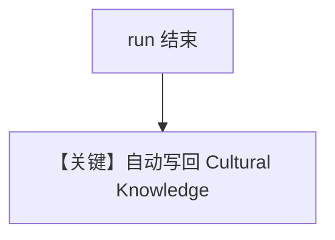

# 03_automatic_cultural_management.py — 实现原理分析

<!-- cookbook-py-source:start -->
## 完整源码

```python
"""
03 Automatic Cultural Management
=============================

Automatically update cultural knowledge based on Agent interactions.
"""

from agno.agent import Agent
from agno.db.sqlite import SqliteDb
from agno.models.openai import OpenAIResponses

# ---------------------------------------------------------------------------
# Step 1. Initialize the database (same one used in 01_create_cultural_knowledge.py)
# ---------------------------------------------------------------------------
db = SqliteDb(db_file="tmp/demo.db")

# ---------------------------------------------------------------------------
# Create Agent
# ---------------------------------------------------------------------------
# The Agent will automatically add or update cultural knowledge after each run.
agent = Agent(
    db=db,
    model=OpenAIResponses(id="gpt-5.2"),
    update_cultural_knowledge=True,  # enables automatic cultural updates
)

# ---------------------------------------------------------------------------
# Run Agent
# ---------------------------------------------------------------------------
if __name__ == "__main__":
    # ---------------------------------------------------------------------------
    # Step 3. Ask the Agent to generate a response
    # ---------------------------------------------------------------------------
    agent.print_response(
        "What would be the best way to cook ramen? Detailed and specific instructions generally work better than general advice.",
        stream=True,
        markdown=True,
    )
```

<!-- cookbook-py-source:end -->

> 源文件：`cookbook/02_agents/14_advanced/03_automatic_cultural_management.py`

## 概述

本示例展示 **`update_cultural_knowledge=True`**：每次 `print_response` 后由框架触发文化层更新（与 `enable_agentic_culture` 等配合见源码），用户以煮拉面场景提供可沉淀经验。

**核心配置：** `db` + `model` + `update_cultural_knowledge=True`。

## 运行机制与因果链

读→写文化：副作用为 **DB 中文化条目递增/修订**。

## Mermaid 流程图


```mermaid
flowchart TD
    R["run 结束"] --> U["【关键】自动写回 Cultural Knowledge"]
```

## 关键源码文件索引

| 文件 | 作用 |
|------|------|
| `agno/agent/_run.py` | 文化更新钩子 |
