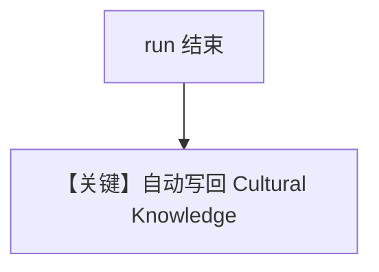

# 03_automatic_cultural_management.py — 实现原理分析

> 源文件：`cookbook/02_agents/14_advanced/03_automatic_cultural_management.py`

## 概述

本示例展示 **`update_cultural_knowledge=True`**：每次 `print_response` 后由框架触发文化层更新（与 `enable_agentic_culture` 等配合见源码），用户以煮拉面场景提供可沉淀经验。

**核心配置：** `db` + `model` + `update_cultural_knowledge=True`。

## 运行机制与因果链

读→写文化：副作用为 **DB 中文化条目递增/修订**。

## Mermaid 流程图

```mermaid
flowchart TD
    R["run 结束"] --> U["【关键】自动写回 Cultural Knowledge"]
```

## 关键源码文件索引

| 文件 | 作用 |
|------|------|
| `agno/agent/_run.py` | 文化更新钩子 |
