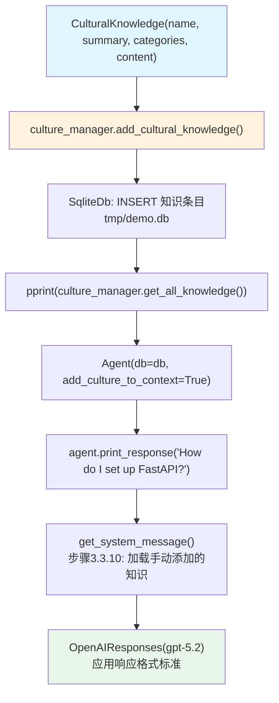

# 04_manually_add_culture.py — 实现原理分析

> 源文件：`cookbook/02_agents/14_advanced/04_manually_add_culture.py`

## 概述

本示例展示 Agno 的 **手动添加文化知识**机制：通过 `CultureManager.add_cultural_knowledge()` 直接插入预定义的 `CulturalKnowledge` 对象（无需 LLM 泛化），然后 Agent 使用 `add_culture_to_context=True` 加载。

**核心配置一览：**

| 配置项 | 值 | 说明 |
|--------|------|------|
| `CultureManager.db` | `SqliteDb(db_file="tmp/demo.db")` | 共享 DB |
| `CultureManager.model` | `None`（未传入） | 手动添加不需要 LLM |
| `Agent.model` | `OpenAIResponses(id="gpt-5.2")` | 主模型 |
| `Agent.add_culture_to_context` | `True` | 注入已有文化知识 |

## 核心组件解析

### 手动构建 CulturalKnowledge

```python
from agno.db.schemas.culture import CulturalKnowledge

response_format = CulturalKnowledge(
    name="Response Format Standard (Agno)",
    summary="Keep responses concise, scannable, and runnable-first where applicable.",
    categories=["communication", "ux"],
    content=(
        "- Lead with the minimal runnable snippet...\n"
        "- Use numbered steps for procedures...\n"
    ),
    notes=["Derived from repeated feedback favoring actionable answers."],
    metadata={"source": "manual_seed", "version": 1},
)

culture_manager.add_cultural_knowledge(response_format)
```

### 与 create_cultural_knowledge 的差异

| 方式 | `create_cultural_knowledge(message)` | `add_cultural_knowledge(obj)` |
|------|--------------------------------------|-------------------------------|
| LLM 介入 | 是（泛化消息） | 否（直接插入） |
| 控制粒度 | LLM 决定结构 | 完全自定义 |
| 速度 | 慢（LLM 调用） | 快（直接写 DB） |
| 需要 model | 是 | 否 |
| 适用场景 | 从交互中提炼 | 预置种子知识 |

## System Prompt 组装

```text
<cultural_knowledge>
  <knowledge id="...">
    <name>Response Format Standard (Agno)</name>
    <content>
      - Lead with the minimal runnable snippet...
      ...
    </content>
  </knowledge>
</cultural_knowledge>
```

## Mermaid 流程图



## 关键源码文件索引

| 文件 | 关键函数/类 | 作用 |
|------|------------|------|
| `agno/db/schemas/culture.py` | `CulturalKnowledge` | 知识条目数据模型 |
| `agno/culture/manager.py` | `add_cultural_knowledge()` | 手动插入（无 LLM） |
| `agno/culture/manager.py` | `get_all_knowledge()` | 查询验证 |
