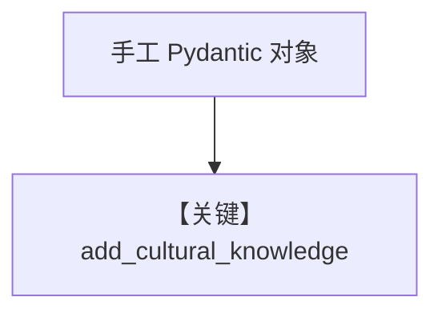

# 04_manually_add_culture.py — 实现原理分析

> 源文件：`cookbook/02_agents/14_advanced/04_manually_add_culture.py`

## 概述

本示例展示 **无模型蒸馏的手工文化条目**：构造 `CulturalKnowledge(...)`，`culture_manager.add_cultural_knowledge(...)` 直接落库；再启 Agent `add_culture_to_context=True` 验证读取。

**核心配置：** `CultureManager(db=db)`（可无 model）；Pydantic `CulturalKnowledge` 字段见 `.py`。

## 运行机制与因果链

适合 **导入企业规范** 而非 LLM 生成。

## Mermaid 流程图

```mermaid
flowchart TD
    H["手工 Pydantic 对象"] --> A["【关键】add_cultural_knowledge"]
```

## 关键源码文件索引

| 文件 | 作用 |
|------|------|
| `agno/db/schemas/culture.py` | `CulturalKnowledge` |
