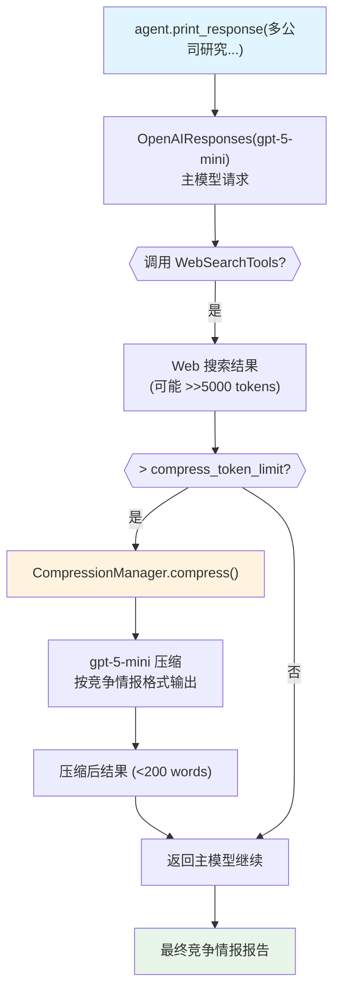

# advanced_compression.py — 实现原理分析

> 源文件：`cookbook/02_agents/14_advanced/advanced_compression.py`

## 概述

本示例展示 Agno 的 **高级工具结果压缩**机制：通过 `CompressionManager` 配置 `compress_token_limit` 和自定义 `compress_tool_call_instructions`，当工具结果超过 token 阈值时，由专用压缩模型将 Web 搜索结果压缩为竞争情报摘要格式，减少 context 占用。

**核心配置一览：**

| 配置项 | 值 | 说明 |
|--------|------|------|
| `model` | `OpenAIResponses(id="gpt-5-mini")` | 主 Agent 模型 |
| `tools` | `[WebSearchTools()]` | Web 搜索工具 |
| `description` | `"Specialized in tracking competitor activities"` | 描述 |
| `instructions` | `"Use the search tools..."` | 搜索指令 |
| `db` | `SqliteDb(...)` | 会话持久化 |
| `compression_manager` | `CompressionManager(...)` | 压缩管理器 |
| `add_history_to_context` | `True` | 历史消息 |
| `num_history_runs` | `3` | 历史轮次限制 |
| `session_id` | `"token_based_tool_call_compression"` | 固定会话 |

**CompressionManager 配置：**

| 配置项 | 值 | 说明 |
|--------|------|------|
| `model` | `OpenAIResponses(id="gpt-5-mini")` | 压缩模型 |
| `compress_token_limit` | `5000` | 超过此 token 数触发压缩 |
| `compress_tool_call_instructions` | 自定义竞争情报格式 | 压缩 prompt |

## 架构分层

```
用户代码层                    agno.agent 层               压缩层
┌──────────────────────┐    ┌──────────────────────┐  ┌──────────────────────┐
│ advanced_compression │    │ Agent._run()          │  │ CompressionManager   │
│ .py                  │    │  ├─ 主模型请求        │  │  ├─ compress_token_  │
│                      │───>│  ├─ 工具调用(Web搜索) │  │  │   limit=5000       │
│ agent.print_response │    │  ├─ 工具结果 > 5000   │─>│  │                    │
│   (多公司研究...)    │    │  │  token → 触发压缩  │  │  └─ model.invoke()   │
│                      │    │  └─ 压缩后继续主模型  │  │      压缩为摘要格式  │
└──────────────────────┘    └──────────────────────┘  └──────────────────────┘
                                         │                          │
                          ┌──────────────┘              ┌──────────┘
                          ▼                             ▼
              ┌──────────────────────┐    ┌──────────────────────┐
              │ OpenAIResponses      │    │ OpenAIResponses      │
              │ gpt-5-mini（主）     │    │ gpt-5-mini（压缩）   │
              └──────────────────────┘    └──────────────────────┘
```

## 核心组件解析

### CompressionManager 配置

```python
compression_prompt = """
    You are a compression expert. YOUR GOAL: Extract only actionable competitive insights.
    
    OUTPUT FORMAT:
    "[Company Name] - [Date]: [Action/Event] ([Key Numbers/Details])"
    
    Keep it under 200 words total.
"""

compression_manager = CompressionManager(
    model=OpenAIResponses(id="gpt-5-mini"),
    compress_token_limit=5000,                        # token 阈值
    compress_tool_call_instructions=compression_prompt, # 自定义压缩 prompt
)
```

### 与 tool_call_compression.py 的差异

| 特性 | `tool_call_compression.py` | `advanced_compression.py` |
|------|---------------------------|---------------------------|
| 触发方式 | `compress_tool_results=True`（总是压缩） | token 阈值触发（>5000） |
| 压缩模型 | 默认内置模型 | 自定义 CompressionManager |
| 压缩 prompt | 默认通用 prompt | 自定义（竞争情报格式） |

## System Prompt 组装

| 序号 | 组成部分 | 值 | 是否生效 |
|------|---------|-----|---------|
| 3.3.1 | `description` | "Specialized in tracking..." | 是 |
| 3.3.3 | `instructions` | "Use the search tools..." | 是 |

### 最终 System Prompt

```text
Specialized in tracking competitor activities

Use the search tools and always use the latest information and data.
```

## Mermaid 流程图



## 关键源码文件索引

| 文件 | 关键函数/类 | 作用 |
|------|------------|------|
| `agno/compression/manager.py` | `CompressionManager` | 压缩管理器 |
| `agno/agent/agent.py` | `compression_manager` | Agent 压缩配置 |
| `agno/tools/websearch.py` | `WebSearchTools` | Web 搜索工具 |
