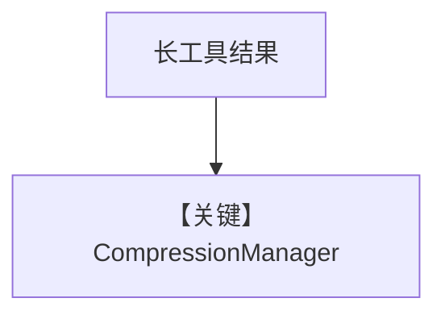

# advanced_compression.py — 实现原理分析

> 源文件：`cookbook/02_agents/14_advanced/advanced_compression.py`

## 概述

本示例展示 **`CompressionManager` 按 token 阈值压缩工具结果**：`compress_token_limit=5000`，`compress_tool_call_instructions` 长提示定义竞争情报压缩格式；Agent 配 `WebSearchTools`、`compression_manager`、历史 3 条。

**核心配置一览：**

| 配置项 | 说明 |
|--------|------|
| `compression_manager` | `CompressionManager(model, compress_token_limit, compress_tool_call_instructions)` |
| `add_history_to_context` | `True`，`num_history_runs=3` |

## 运行机制与因果链

检索结果超限时由 **压缩模型** 摘要再注入上下文；`metrics.details` 可出现 `compression_model` 键（见 `combined_metrics` 文档）。

## Mermaid 流程图

```mermaid
flowchart TD
    T["长工具结果"] --> C["【关键】CompressionManager"]
```

## 关键源码文件索引

| 文件 | 作用 |
|------|------|
| `agno/compression/manager.py` | `CompressionManager` |
