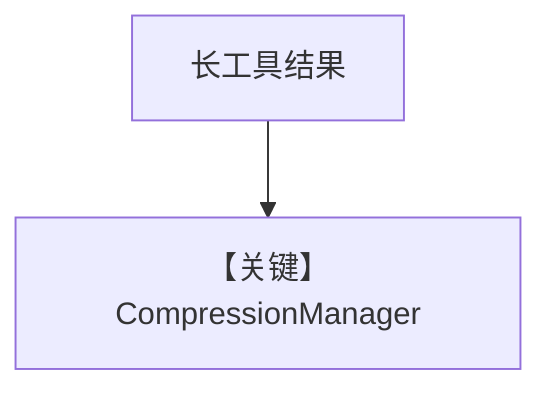

# advanced_compression.py — 实现原理分析

<!-- cookbook-py-source:start -->
## 完整源码

```python
"""
Advanced Compression
=============================

This example shows how to set a context token based limit for tool call compression.
"""

from agno.agent import Agent
from agno.compression.manager import CompressionManager
from agno.db.sqlite import SqliteDb
from agno.models.openai import OpenAIResponses
from agno.tools.websearch import WebSearchTools

compression_prompt = """
    You are a compression expert. Your goal is to compress web search results for a competitive intelligence analyst.
    
    YOUR GOAL: Extract only actionable competitive insights while being extremely concise.
    
    MUST PRESERVE:
    - Competitor names and specific actions (product launches, partnerships, acquisitions, pricing changes)
    - Exact numbers (revenue, market share, growth rates, pricing, headcount)
    - Precise dates (announcement dates, launch dates, deal dates)
    - Direct quotes from executives or official statements
    - Funding rounds and valuations
    
    MUST REMOVE:
    - Company history and background information
    - General industry trends (unless competitor-specific)
    - Analyst opinions and speculation (keep only facts)
    - Detailed product descriptions (keep only key differentiators and pricing)
    - Marketing fluff and promotional language
    
    OUTPUT FORMAT:
    Return a bullet-point list where each line follows this format:
    "[Company Name] - [Date]: [Action/Event] ([Key Numbers/Details])"
    
    Keep it under 200 words total. Be ruthlessly concise. Facts only.
    
    Example:
    - Acme Corp - Mar 15, 2024: Launched AcmeGPT at $99/user/month, targeting enterprise market
    - TechCo - Feb 10, 2024: Acquired DataStart for $150M, gaining 500 enterprise customers
"""

compression_manager = CompressionManager(
    model=OpenAIResponses(id="gpt-5-mini"),
    compress_token_limit=5000,
    compress_tool_call_instructions=compression_prompt,
)

# ---------------------------------------------------------------------------
# Create Agent
# ---------------------------------------------------------------------------
agent = Agent(
    model=OpenAIResponses(id="gpt-5-mini"),
    tools=[WebSearchTools()],
    description="Specialized in tracking competitor activities",
    instructions="Use the search tools and always use the latest information and data.",
    db=SqliteDb(db_file="tmp/token_based_tool_call_compression.db"),
    compression_manager=compression_manager,
    add_history_to_context=True,  # Add history to context
    num_history_runs=3,
    session_id="token_based_tool_call_compression",
)

# ---------------------------------------------------------------------------
# Run Agent
# ---------------------------------------------------------------------------
if __name__ == "__main__":
    agent.print_response(
        """
        Use the search tools and always use the latest information and data.
        Research recent activities (last 3 months) for these AI companies:
        
        1. OpenAI - product launches, partnerships, pricing
        2. Anthropic - new features, enterprise deals, funding
        3. Google DeepMind - research breakthroughs, product releases
        4. Meta AI - open source releases, research papers
       
        For each, find specific actions with dates and numbers.""",
        stream=True,
    )
```

<!-- cookbook-py-source:end -->

> 源文件：`cookbook/02_agents/14_advanced/advanced_compression.py`

## 概述

本示例展示 **`CompressionManager` 按 token 阈值压缩工具结果**：`compress_token_limit=5000`，`compress_tool_call_instructions` 长提示定义竞争情报压缩格式；Agent 配 `WebSearchTools`、`compression_manager`、历史 3 条。

**核心配置一览：**

| 配置项 | 说明 |
|--------|------|
| `compression_manager` | `CompressionManager(model, compress_token_limit, compress_tool_call_instructions)` |
| `add_history_to_context` | `True`，`num_history_runs=3` |

## 运行机制与因果链

检索结果超限时由 **压缩模型** 摘要再注入上下文；`metrics.details` 可出现 `compression_model` 键（见 `combined_metrics` 文档）。

## Mermaid 流程图


```mermaid
flowchart TD
    T["长工具结果"] --> C["【关键】CompressionManager"]
```

## 关键源码文件索引

| 文件 | 作用 |
|------|------|
| `agno/compression/manager.py` | `CompressionManager` |
