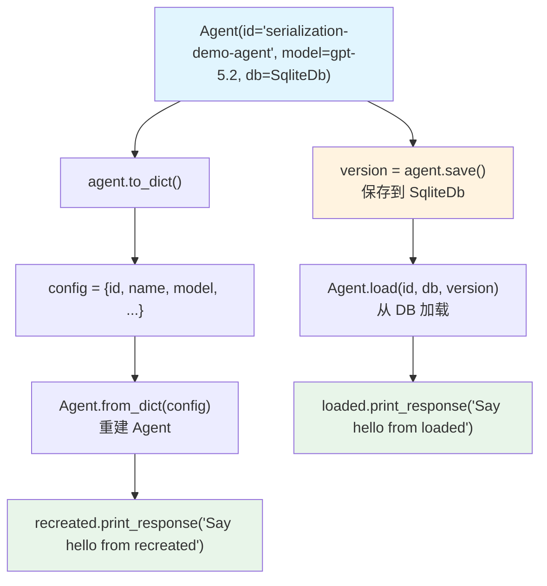

# agent_serialization.py — 实现原理分析

> 源文件：`cookbook/02_agents/14_advanced/agent_serialization.py`

## 概述

本示例展示 Agno 的 **Agent 序列化与反序列化**机制：通过 `to_dict()`/`from_dict()` 实现内存中序列化，以及 `save()`/`load()` 实现持久化到 DB，使 Agent 配置可在进程间或版本间复现。

**核心配置一览：**

| 配置项 | 值 | 说明 |
|--------|------|------|
| `id` | `"serialization-demo-agent"` | Agent 唯一 ID（序列化标识） |
| `name` | `"Serialization Demo Agent"` | Agent 名称 |
| `model` | `OpenAIResponses(id="gpt-5.2")` | Responses API |
| `db` | `SqliteDb(db_file="tmp/agents.db")` | Agent 配置持久化存储 |

## 核心组件解析

### to_dict / from_dict（内存序列化）

```python
# 序列化为字典
config = agent.to_dict()
# {
#   "id": "serialization-demo-agent",
#   "name": "Serialization Demo Agent",
#   "model": {"type": "OpenAIResponses", "id": "gpt-5.2"},
#   ...
# }

# 从字典重建 Agent
recreated = Agent.from_dict(config)
recreated.print_response("Say hello from a recreated agent.", stream=True)
```

### save / load（DB 持久化）

```python
# 保存到 DB，返回版本号
version = agent.save()

# 从 DB 按 ID + 版本号加载
loaded = Agent.load(
    id=agent.id,           # "serialization-demo-agent"
    db=agent_db,           # SqliteDb
    version=version,       # 特定版本
)
loaded.print_response("Say hello from a loaded agent.", stream=True)
```

### 版本管理

`agent.save()` 返回版本号，允许保存 Agent 的多个历史版本。通过 `version=` 参数可精确加载特定版本，支持回滚。

### to_dict vs save 对比

| 特性 | `to_dict()` / `from_dict()` | `save()` / `load()` |
|------|------------------------------|---------------------|
| 存储位置 | 内存/字典 | SqliteDb |
| 跨进程 | 需手动传递字典 | 通过 DB（持久化） |
| 版本控制 | 无 | 有（version 参数） |
| 适用场景 | 临时复制/测试 | 长期持久化/跨环境 |

## System Prompt 组装

| 序号 | 组成部分 | 值 | 是否生效 |
|------|---------|-----|---------|
| 3.2.4 | `add_name_to_context` | "Serialization Demo Agent" | 是 |

### 最终 System Prompt

```text
Your name is: Serialization Demo Agent
```

## Mermaid 流程图



## 关键源码文件索引

| 文件 | 关键函数/类 | 作用 |
|------|------------|------|
| `agno/agent/agent.py` | `to_dict()`, `from_dict()` | 内存序列化 |
| `agno/agent/agent.py` | `save()`, `load()` | DB 持久化 |
| `agno/db/sqlite/` | `SqliteDb` | 存储后端 |
