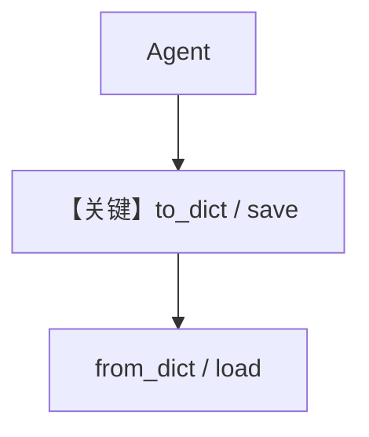

# agent_serialization.py — 实现原理分析

> 源文件：`cookbook/02_agents/14_advanced/agent_serialization.py`

## 概述

本示例展示 **Agent 配置序列化与版本化**：`to_dict()` / `from_dict()` 重建；`save()` 与 `load(id, db, version)` 从 `SqliteDb` 取回等价 Agent 并 `print_response`。

**核心配置：** `id="serialization-demo-agent"`；`db=tmp/agents.db`。

## 运行机制与因果链

用于 **持久化 Agent 配方** 与多版本回滚（依 DB schema）。

## Mermaid 流程图

```mermaid
flowchart TD
    A["Agent"] --> D["【关键】to_dict / save"]
    D --> L["from_dict / load"]
```

## 关键源码文件索引

| 文件 | 作用 |
|------|------|
| `agno/agent/agent.py` | `to_dict`；`from_dict`；`save`；`load` |
