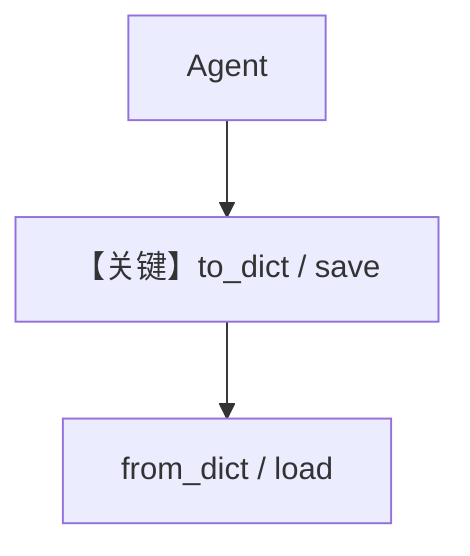

# agent_serialization.py — 实现原理分析

<!-- cookbook-py-source:start -->
## 完整源码

```python
"""
Agent Serialization
=============================

Agent Serialization.
"""

from agno.agent import Agent
from agno.db.sqlite import SqliteDb
from agno.models.openai import OpenAIResponses

# ---------------------------------------------------------------------------
# Setup
# ---------------------------------------------------------------------------
agent_db = SqliteDb(db_file="tmp/agents.db")

# ---------------------------------------------------------------------------
# Create Agent
# ---------------------------------------------------------------------------
agent = Agent(
    id="serialization-demo-agent",
    name="Serialization Demo Agent",
    model=OpenAIResponses(id="gpt-5.2"),
    db=agent_db,
)

# ---------------------------------------------------------------------------
# Run Agent
# ---------------------------------------------------------------------------
if __name__ == "__main__":
    config = agent.to_dict()
    recreated = Agent.from_dict(config)

    version = agent.save()
    loaded = Agent.load(id=agent.id, db=agent_db, version=version)

    recreated.print_response("Say hello from a recreated agent.", stream=True)
    loaded.print_response("Say hello from a loaded agent.", stream=True)
```

<!-- cookbook-py-source:end -->

> 源文件：`cookbook/02_agents/14_advanced/agent_serialization.py`

## 概述

本示例展示 **Agent 配置序列化与版本化**：`to_dict()` / `from_dict()` 重建；`save()` 与 `load(id, db, version)` 从 `SqliteDb` 取回等价 Agent 并 `print_response`。

**核心配置：** `id="serialization-demo-agent"`；`db=tmp/agents.db`。

## 运行机制与因果链

用于 **持久化 Agent 配方** 与多版本回滚（依 DB schema）。

## Mermaid 流程图


```mermaid
flowchart TD
    A["Agent"] --> D["【关键】to_dict / save"]
    D --> L["from_dict / load"]
```

## 关键源码文件索引

| 文件 | 作用 |
|------|------|
| `agno/agent/agent.py` | `to_dict`；`from_dict`；`save`；`load` |
