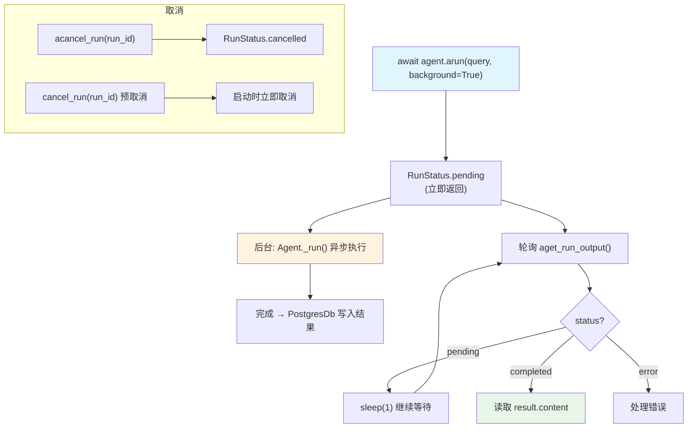

# background_execution.py — 实现原理分析

> 源文件：`cookbook/02_agents/14_advanced/background_execution.py`

## 概述

本示例展示 Agno 的 **后台异步执行**机制：通过 `arun(background=True)` 立即返回 `RunStatus.pending`，Agent 在后台异步执行，调用方轮询 `aget_run_output()` 获取结果，支持取消（`acancel_run()`）和运行前取消（cancel-before-start）语义。

**核心配置一览：**

| 配置项 | 值 | 说明 |
|--------|------|------|
| `model` | `OpenAIResponses(id="gpt-5-mini")` | Responses API |
| `db` | `PostgresDb(db_url=...)` | 必须使用 DB（后台结果持久化） |
| `background=True` | `arun()` 参数 | 非阻塞执行 |

## 架构分层

```
用户代码层                    后台执行层
┌──────────────────────┐    ┌──────────────────────────────────────┐
│ background_          │    │ Agent._run()（后台任务）               │
│ execution.py         │    │  ├─ asyncio 事件循环中后台运行        │
│                      │    │  ├─ 完成后写入 PostgresDb            │
│ run_output = await   │    │  └─ status: pending → completed      │
│   agent.arun(        │    │                                       │
│     ...,             │    │ 轮询接口:                             │
│     background=True  │───>│  agent.aget_run_output(              │
│   )                  │    │    run_id=..., session_id=...)        │
│ # status=pending     │    │  → 从 DB 读取 RunOutput              │
│                      │    │                                       │
│ for i in range(30):  │    │ 取消接口:                             │
│   result = await     │    │  agent.acancel_run(run_id=...)        │
│     agent.           │    │                                       │
│     aget_run_output  │    │ 预取消:                               │
│     (...)            │    │  cancel_run(run_id)  # 运行前取消     │
└──────────────────────┘    └──────────────────────────────────────┘
```

## 核心组件解析

### 后台运行与轮询

```python
# 启动后台运行（立即返回）
run_output = await agent.arun(
    "What is the capital of France? Answer in one sentence.",
    background=True,
)
print(run_output.status)  # RunStatus.pending

# 轮询直至完成
for i in range(30):
    await asyncio.sleep(1)
    result = await agent.aget_run_output(
        run_id=run_output.run_id,
        session_id=run_output.session_id,
    )
    if result and result.status == RunStatus.completed:
        print(result.content)
        break
```

### 运行中取消

```python
# 启动长时间任务
run_output = await agent.arun("Write 5000 words...", background=True)
await asyncio.sleep(2)  # 让任务开始

# 取消
cancelled = await agent.acancel_run(run_id=run_output.run_id)
```

### 运行前取消（cancel-before-start）

```python
from agno.run.cancel import cancel_run

run_id = str(uuid4())
cancel_run(run_id)  # 预先标记为取消

# 启动时检测到预取消，立即结束
run_output = await agent.arun("This won't run.", background=True, run_id=run_id)
# status → cancelled
```

### RunStatus 枚举

| 值 | 含义 |
|----|------|
| `RunStatus.pending` | 后台任务尚未完成 |
| `RunStatus.completed` | 成功完成 |
| `RunStatus.error` | 执行出错 |
| `RunStatus.cancelled` | 被取消 |

### 为什么需要 PostgresDb

后台运行在不同协程中执行并写入 DB，调用方通过 DB 轮询结果。PostgresDb 支持并发写入，而 SqliteDb 对并发支持有限。

## System Prompt 组装

```text
（空，各 Agent 未设置 instructions/markdown 等）
```

## Mermaid 流程图



## 关键源码文件索引

| 文件 | 关键函数/类 | 作用 |
|------|------------|------|
| `agno/agent/agent.py` | `arun(background=True)` | 后台运行入口 |
| `agno/agent/agent.py` | `aget_run_output()` | 轮询结果 |
| `agno/agent/agent.py` | `acancel_run()` | 异步取消 |
| `agno/run/cancel.py` | `cancel_run()` | 预取消 |
| `agno/run/base.py` | `RunStatus` | 运行状态枚举 |
| `agno/db/postgres/` | `PostgresDb` | 后台结果持久化（必须） |
