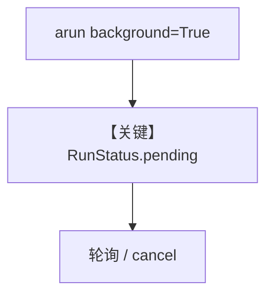

# background_execution.py — 实现原理分析

<!-- cookbook-py-source:start -->
## 完整源码

```python
"""
Example demonstrating background execution with polling and cancellation.

Background execution allows you to start an agent run that returns immediately
with a PENDING status, while the actual work continues in the background.
You can then poll for completion or cancel the run.

Requirements:
- PostgreSQL running (./cookbook/scripts/run_pgvector.sh)
- OPENAI_API_KEY set

Usage:
    .venvs/demo/bin/python cookbook/02_agents/other/background_execution.py
"""

import asyncio

from agno.agent import Agent
from agno.db.postgres import PostgresDb
from agno.models.openai import OpenAIResponses
from agno.run.base import RunStatus

# ---------------------------------------------------------------------------
# Config
# ---------------------------------------------------------------------------

db = PostgresDb(
    db_url="postgresql+psycopg://ai:ai@localhost:5532/ai",
    session_table="background_exec_sessions",
)


# ---------------------------------------------------------------------------
# Create and Run Background Examples
# ---------------------------------------------------------------------------


async def example_background_run_with_polling():
    """Start a background run and poll until complete."""
    print("=" * 60)
    print("Example 1: Background run with polling")
    print("=" * 60)

    agent = Agent(
        name="BackgroundAgent",
        model=OpenAIResponses(id="gpt-5-mini"),
        description="An agent that runs in the background",
        db=db,
    )

    # Start a background run — returns immediately with PENDING status
    run_output = await agent.arun(
        "What is the capital of France? Answer in one sentence.",
        background=True,
    )

    print(f"Run ID: {run_output.run_id}")
    print(f"Session ID: {run_output.session_id}")
    print(f"Status: {run_output.status}")
    assert run_output.status == RunStatus.pending, (
        f"Expected PENDING, got {run_output.status}"
    )

    # Poll for completion
    print("\nPolling for completion...")
    for i in range(30):
        await asyncio.sleep(1)
        result = await agent.aget_run_output(
            run_id=run_output.run_id,
            session_id=run_output.session_id,
        )
        if result is None:
            print(f"  [{i + 1}s] Run not found in DB yet")
            continue

        print(f"  [{i + 1}s] Status: {result.status}")

        if result.status == RunStatus.completed:
            print(f"\nCompleted! Content: {result.content}")
            break
        elif result.status == RunStatus.error:
            print(f"\nFailed! Content: {result.content}")
            break
    else:
        print("\nTimed out waiting for completion")

    print()


async def example_cancel_background_run():
    """Start a background run and cancel it before completion."""
    print("=" * 60)
    print("Example 2: Cancel a background run")
    print("=" * 60)

    agent = Agent(
        name="CancellableAgent",
        model=OpenAIResponses(id="gpt-5-mini"),
        description="An agent whose run can be cancelled",
        db=db,
    )

    # Start a long background run
    run_output = await agent.arun(
        "Write a very detailed essay about the history of computing. "
        "Make it at least 5000 words with sections and subsections.",
        background=True,
    )

    print(f"Run ID: {run_output.run_id}")
    print(f"Status: {run_output.status}")

    # Wait a moment for the run to start
    await asyncio.sleep(2)

    # Cancel the run
    print("Cancelling run...")
    cancelled = await agent.acancel_run(run_id=run_output.run_id)
    print(f"Cancel result: {cancelled}")

    # Check the final state
    await asyncio.sleep(1)
    result = await agent.aget_run_output(
        run_id=run_output.run_id,
        session_id=run_output.session_id,
    )
    if result:
        print(f"Final status: {result.status}")
    print()


async def example_cancel_before_start():
    """Cancel a run before it even starts (cancel-before-start semantics)."""
    print("=" * 60)
    print("Example 3: Cancel-before-start")
    print("=" * 60)

    from agno.run.cancel import cancel_run

    agent = Agent(
        name="PreCancelAgent",
        model=OpenAIResponses(id="gpt-5-mini"),
        description="An agent whose run is cancelled before starting",
        db=db,
    )

    # Pre-generate a run ID
    from uuid import uuid4

    run_id = str(uuid4())

    # Cancel the run BEFORE it starts
    print(f"Pre-cancelling run {run_id}...")
    cancel_run(run_id)

    # Now start the run with that ID — it should detect the cancellation
    run_output = await agent.arun(
        "This should be cancelled before it runs.",
        background=True,
        run_id=run_id,
    )

    print(f"Run ID: {run_output.run_id}")
    print(f"Initial status: {run_output.status}")

    # Wait and check — the background task should detect the cancellation
    await asyncio.sleep(2)
    result = await agent.aget_run_output(
        run_id=run_output.run_id,
        session_id=run_output.session_id,
    )
    if result:
        print(f"Final status: {result.status}")
    print()


async def main():
    await example_background_run_with_polling()
    await example_cancel_background_run()
    await example_cancel_before_start()
    print("All examples completed!")


if __name__ == "__main__":
    asyncio.run(main())
```

<!-- cookbook-py-source:end -->

> 源文件：`cookbook/02_agents/14_advanced/background_execution.py`

## 概述

本示例展示 **`arun(..., background=True)`**：立即返回 `RunStatus.pending`，工作在后台继续；脚本演示轮询完成与 **取消**（见文件后半）。依赖 **Postgres** `PostgresDb`。

**核心配置：** `OpenAIResponses`；`session_table="background_exec_sessions"`。

## 运行机制与因果链

适合长任务 API：**先拿 run_id**，再轮询或 Webhook；取消走全局 cancellation 管理器。

## Mermaid 流程图


```mermaid
flowchart TD
    A["arun background=True"] --> P["【关键】RunStatus.pending"]
    P --> Q["轮询 / cancel"]
```

## 关键源码文件索引

| 文件 | 作用 |
|------|------|
| `agno/agent` | `background` 参数 |
| `agno/run/base.py` | `RunStatus` |
