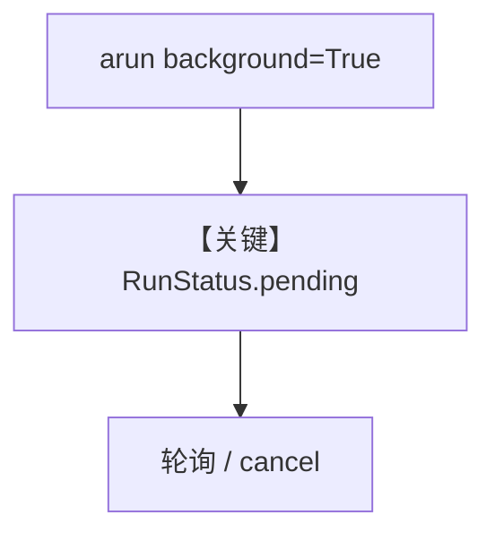

# background_execution.py — 实现原理分析

> 源文件：`cookbook/02_agents/14_advanced/background_execution.py`

## 概述

本示例展示 **`arun(..., background=True)`**：立即返回 `RunStatus.pending`，工作在后台继续；脚本演示轮询完成与 **取消**（见文件后半）。依赖 **Postgres** `PostgresDb`。

**核心配置：** `OpenAIResponses`；`session_table="background_exec_sessions"`。

## 运行机制与因果链

适合长任务 API：**先拿 run_id**，再轮询或 Webhook；取消走全局 cancellation 管理器。

## Mermaid 流程图

```mermaid
flowchart TD
    A["arun background=True"] --> P["【关键】RunStatus.pending"]
    P --> Q["轮询 / cancel"]
```

## 关键源码文件索引

| 文件 | 作用 |
|------|------|
| `agno/agent` | `background` 参数 |
| `agno/run/base.py` | `RunStatus` |
