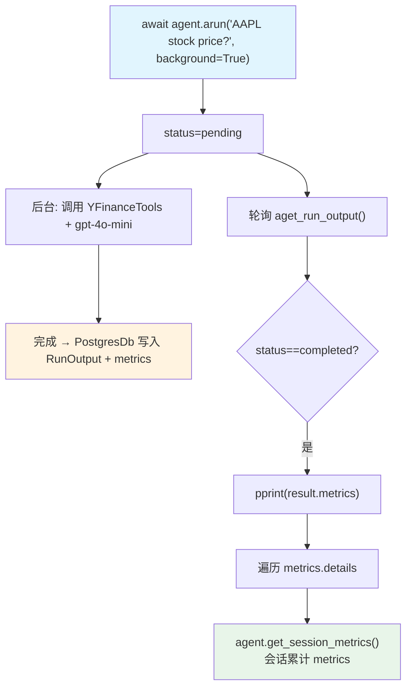

# background_execution_metrics.py — 实现原理分析

> 源文件：`cookbook/02_agents/14_advanced/background_execution_metrics.py`

## 概述

本示例验证 Agno **后台运行的 metrics 完整性**：后台异步运行完成后，从 DB 读取的 `RunOutput` 包含与同步运行相同的 metrics（token 计数、模型详情、耗时、首 token 时间），以及会话级别 metrics 聚合。

**核心配置一览：**

| 配置项 | 值 | 说明 |
|--------|------|------|
| `name` | `"BackgroundMetricsAgent"` | Agent 名称 |
| `model` | `OpenAIChat(id="gpt-4o-mini")` | Chat Completions API |
| `tools` | `[YFinanceTools(enable_stock_price=True)]` | 股票价格工具 |
| `db` | `PostgresDb(db_url=...)` | 后台结果 + metrics 持久化 |

## 核心组件解析

### 后台 metrics 读取

```python
# 启动后台运行
run_output = await agent.arun(
    "What is the stock price of AAPL?",
    background=True,
)

# 轮询完成
result = None
for i in range(30):
    await asyncio.sleep(1)
    result = await agent.aget_run_output(
        run_id=run_output.run_id,
        session_id=run_output.session_id,
    )
    if result and result.status in (RunStatus.completed, RunStatus.error):
        break

# 读取 metrics（与同步运行相同结构）
pprint(result.metrics)           # RunMetrics 对象

# 按模型类型分组
for model_type, model_metrics_list in result.metrics.details.items():
    print(f"{model_type}:")       # "model", "tool_call" 等
    for m in model_metrics_list:
        pprint(m)

# 会话级别累计 metrics
session_metrics = agent.get_session_metrics()
pprint(session_metrics)
```

### metrics 结构

```python
# result.metrics（RunMetrics）
{
    "input_tokens": 150,
    "output_tokens": 80,
    "total_tokens": 230,
    "duration": 2.5,               # 秒
    "time_to_first_token": 0.8,    # 秒
    "details": {
        "model": [ModelMetrics(...)],  # 主模型调用
        "tool_call": [ToolMetrics(...)]  # 工具调用（如果有）
    }
}
```

## Mermaid 流程图



## 关键源码文件索引

| 文件 | 关键函数/类 | 作用 |
|------|------------|------|
| `agno/agent/agent.py` | `arun(background=True)`, `aget_run_output()` | 后台运行 |
| `agno/agent/agent.py` | `get_session_metrics()` | 会话 metrics |
| `agno/run/agent.py` | `RunOutput.metrics` | metrics 容器 |
