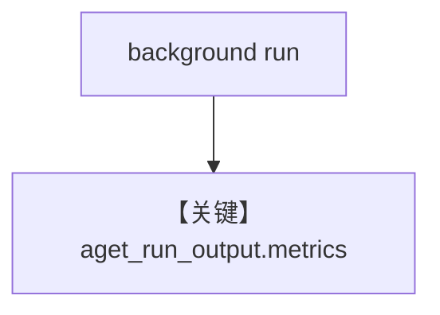

# background_execution_metrics.py — 实现原理分析

> 源文件：`cookbook/02_agents/14_advanced/background_execution_metrics.py`

## 概述

本示例展示 **后台 run 完成后 metrics 与同步 run 一致**：`YFinanceTools` 股价查询，`arun(..., background=True)`，`aget_run_output` 轮询直到非 pending，打印 **token、时长、首 token 时间** 等。

**核心配置：** `OpenAIChat`；`PostgresDb`。

## 运行机制与因果链

验证可观测性：后台不丢 **MessageMetrics**。

## Mermaid 流程图

```mermaid
flowchart TD
    B["background run"] --> M["【关键】aget_run_output.metrics"]
```

## 关键源码文件索引

| 文件 | 作用 |
|------|------|
| `agno/models/metrics.py` | 指标聚合 |
