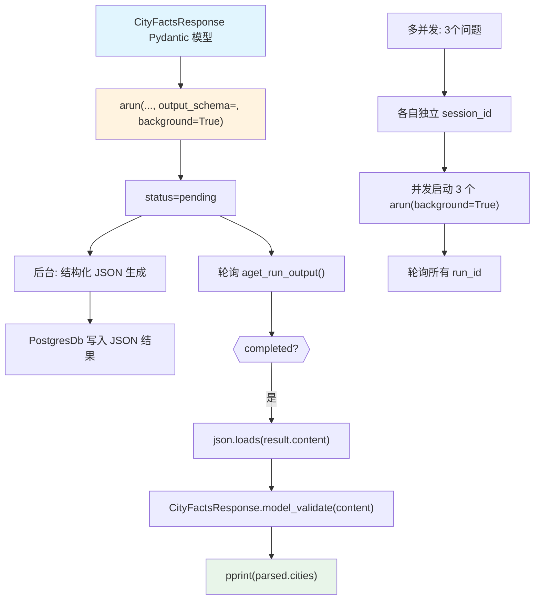

# background_execution_structured.py — 实现原理分析

> 源文件：`cookbook/02_agents/14_advanced/background_execution_structured.py`

## 概述

本示例展示 Agno 的 **后台运行 + 结构化输出 + 多并发**组合：`arun(background=True, output_schema=...)` 实现非阻塞的结构化数据采集，以及 `asyncio.gather` 模式并发启动多个后台任务，并行获取结果。

**核心配置一览：**

| 配置项 | 值 | 说明 |
|--------|------|------|
| `model` | `OpenAIResponses(id="gpt-5-mini")` | Responses API |
| `db` | `PostgresDb(...)` | 后台结果持久化 |
| `output_schema` | `CityFactsResponse`（运行时传入） | Pydantic 结构化输出 |
| `background` | `True`（arun 参数） | 非阻塞执行 |

## 核心组件解析

### 后台运行 + output_schema

```python
class CityFactsResponse(BaseModel):
    cities: List[CityFact]

# output_schema 在 arun 时传入（不在 Agent 构造时）
run_output = await agent.arun(
    "Give me facts about Tokyo, Paris, and New York.",
    output_schema=CityFactsResponse,  # 运行时指定结构化输出
    background=True,
)
# status=pending

# 完成后解析 JSON 内容
content = result.content  # JSON 字符串
if isinstance(content, str):
    content = json.loads(content)
parsed = CityFactsResponse.model_validate(content)
```

### 多并发后台运行

```python
from uuid import uuid4

questions = [
    "What is the tallest mountain?",
    "What is the deepest ocean trench?",
    "What is the longest river?",
]

# 并发启动（各自独立的 session_id 避免冲突）
runs = []
for question in questions:
    session_id = str(uuid4())  # 独立会话，防止 session 竞争
    run_output = await agent.arun(question, background=True, session_id=session_id)
    runs.append(run_output)

# 轮询所有运行直至全部完成
results = {}
for attempt in range(30):
    await asyncio.sleep(1)
    for run in runs:
        if run.run_id not in results:
            result = await agent.aget_run_output(run_id=run.run_id, session_id=run.session_id)
            if result and result.status in (RunStatus.completed, RunStatus.error):
                results[run.run_id] = result
    if len(results) == len(runs):
        break
```

### 为什么每个并发任务需要独立 session_id

多个后台任务写入同一 session 会导致会话状态冲突，使用 `str(uuid4())` 为每个任务生成唯一 session_id。

## Mermaid 流程图



## 关键源码文件索引

| 文件 | 关键函数/类 | 作用 |
|------|------------|------|
| `agno/agent/agent.py` | `arun(background=True, output_schema=)` | 后台+结构化输出 |
| `agno/agent/agent.py` | `aget_run_output()` | 结果轮询 |
| `agno/agent/_response.py` | `get_response_format()` L872 | 结构化输出 response_format |
