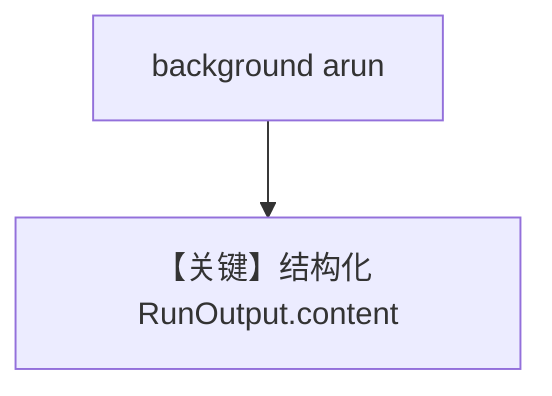

# background_execution_structured.py — 实现原理分析

> 源文件：`cookbook/02_agents/14_advanced/background_execution_structured.py`

## 概述

本示例展示 **background + `output_schema`**：`CityFactsResponse` 等 Pydantic，异步后台跑完后得到 **结构化 content**（脚本内轮询 `RunStatus` 至完成）。

**核心配置：** `PostgresDb`；`OpenAIResponses`。

## 运行机制与因果链

非阻塞 API 仍返回 **强类型** 业务结果。

## Mermaid 流程图

```mermaid
flowchart TD
    BG["background arun"] --> S["【关键】结构化 RunOutput.content"]
```

## 关键源码文件索引

| 文件 | 作用 |
|------|------|
| `agno/agent` | 结构化输出与 background 组合 |
