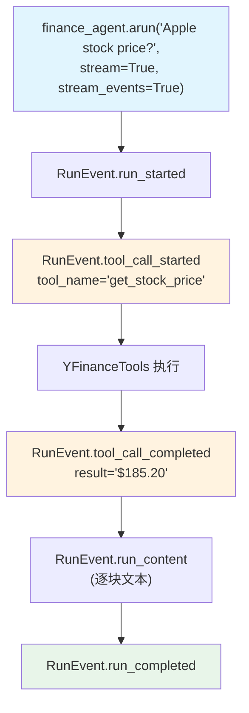

# basic_agent_events.py — 实现原理分析

> 源文件：`cookbook/02_agents/14_advanced/basic_agent_events.py`

## 概述

本示例展示 Agno 的 **流式事件（stream_events）**机制：通过 `arun(stream=True, stream_events=True)` 获取精细化的 `RunOutputEvent` 流，按事件类型处理：运行开始/完成、工具调用开始/完成、内容块。

**核心配置一览：**

| 配置项 | 值 | 说明 |
|--------|------|------|
| `id` | `"finance-agent"` | Agent ID |
| `name` | `"Finance Agent"` | Agent 名称 |
| `model` | `OpenAIResponses(id="gpt-5.2")` | Responses API |
| `tools` | `[YFinanceTools()]` | 股票工具 |
| `stream_events` | `True`（arun 参数） | 启用事件流模式 |

## 架构分层

```
用户代码层                    事件流层
┌──────────────────────┐    ┌──────────────────────────────────────┐
│ basic_agent_events.py│    │ agent.arun(stream=True,              │
│                      │    │            stream_events=True)        │
│ async for            │    │  → AsyncIterator[RunOutputEvent]      │
│   run_output_event   │───>│                                       │
│   in finance_agent.  │    │ RunOutputEvent.event 类型:            │
│   arun(...,          │    │  RunEvent.run_started                 │
│     stream=True,     │    │  RunEvent.tool_call_started           │
│     stream_events=   │    │  RunEvent.tool_call_completed         │
│     True):           │    │  RunEvent.run_content                 │
│   handle(event)      │    │  RunEvent.run_completed               │
└──────────────────────┘    └──────────────────────────────────────┘
```

## 核心组件解析

### RunEvent 事件类型处理

```python
from agno.agent import RunEvent

async for run_output_event in finance_agent.arun(
    prompt,
    stream=True,
    stream_events=True,   # 精细化事件流
):
    # 运行开始/结束
    if run_output_event.event in [RunEvent.run_started, RunEvent.run_completed]:
        print(f"\nEVENT: {run_output_event.event}")

    # 工具调用开始（含工具名和参数）
    if run_output_event.event in [RunEvent.tool_call_started]:
        print(f"TOOL CALL: {run_output_event.tool.tool_name}")
        print(f"TOOL CALL ARGS: {run_output_event.tool.tool_args}")

    # 工具调用完成（含结果）
    if run_output_event.event in [RunEvent.tool_call_completed]:
        print(f"TOOL CALL RESULT: {run_output_event.tool.result}")

    # 内容块（模型生成的文本）
    if run_output_event.event in [RunEvent.run_content]:
        print(run_output_event.content, end="")
```

### stream_events vs 普通 stream 对比

| 特性 | `stream=True`（普通） | `stream=True, stream_events=True` |
|------|----------------------|-----------------------------------|
| 返回类型 | 文本块/RunOutput | `RunOutputEvent` |
| 可见工具调用 | 否 | 是（started + completed） |
| 可见运行状态 | 否 | 是（started/completed） |
| 适用场景 | 简单流式显示 | 需要实时监控工具执行 |

### RunOutputEvent 字段

| 字段 | 存在条件 | 说明 |
|------|---------|------|
| `event` | 总是 | 事件类型（RunEvent 枚举值） |
| `content` | `run_content` 时 | 文本内容块 |
| `tool.tool_name` | 工具事件时 | 工具函数名 |
| `tool.tool_args` | `tool_call_started` | 工具调用参数 |
| `tool.result` | `tool_call_completed` | 工具执行结果 |

## System Prompt 组装

| 序号 | 组成部分 | 值 | 是否生效 |
|------|---------|-----|---------|
| 3.2.4 | `add_name_to_context` | "Finance Agent" | 是 |

```text
Your name is: Finance Agent
```

## Mermaid 流程图



## 关键源码文件索引

| 文件 | 关键函数/类 | 作用 |
|------|------------|------|
| `agno/run/agent.py` | `RunEvent` L134 | 事件类型枚举 |
| `agno/run/agent.py` | `RunOutputEvent` | 事件数据类 |
| `agno/agent/agent.py` | `arun(stream_events=True)` | 事件流入口 |
