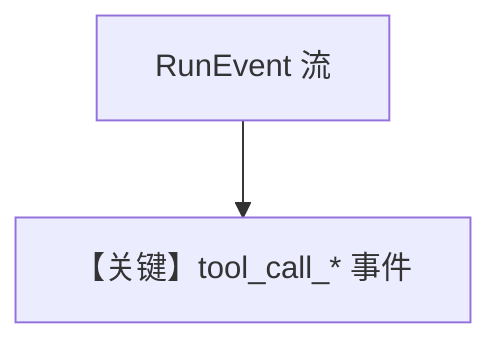

# basic_agent_events.py — 实现原理分析

> 源文件：`cookbook/02_agents/14_advanced/basic_agent_events.py`

## 概述

本示例展示 **`stream_events=True` 时的 `RunEvent`**：`arun` 异步流中区分 `run_started`/`run_completed`、`tool_call_started`/`tool_call_completed`、`run_content`，打印工具名/参数/结果。

**核心配置：** `YFinanceTools`；`OpenAIResponses`。

## 运行机制与因果链

可构建 **可观测 UI**：进度条、工具审计日志。

## Mermaid 流程图

```mermaid
flowchart TD
    E["RunEvent 流"] --> T["【关键】tool_call_* 事件"]
```

## 关键源码文件索引

| 文件 | 作用 |
|------|------|
| `agno/agent` | `RunEvent` 枚举 |
| `agno/run` | 事件负载字段 |
