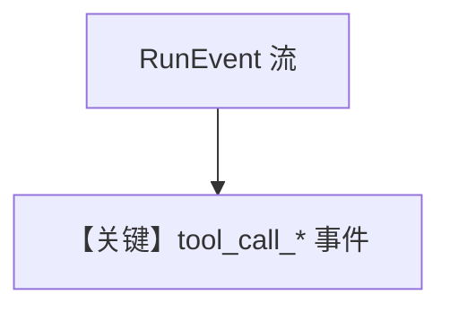

# basic_agent_events.py — 实现原理分析

<!-- cookbook-py-source:start -->
## 完整源码

```python
"""
Basic Agent Events
=============================

Basic Agent Events.
"""

import asyncio

from agno.agent import RunEvent
from agno.agent.agent import Agent
from agno.models.openai import OpenAIResponses
from agno.tools.yfinance import YFinanceTools

# ---------------------------------------------------------------------------
# Create Agent
# ---------------------------------------------------------------------------
finance_agent = Agent(
    id="finance-agent",
    name="Finance Agent",
    model=OpenAIResponses(id="gpt-5.2"),
    tools=[YFinanceTools()],
)


async def run_agent_with_events(prompt: str):
    content_started = False
    async for run_output_event in finance_agent.arun(
        prompt,
        stream=True,
        stream_events=True,
    ):
        if run_output_event.event in [RunEvent.run_started, RunEvent.run_completed]:
            print(f"\nEVENT: {run_output_event.event}")

        if run_output_event.event in [RunEvent.tool_call_started]:
            print(f"\nEVENT: {run_output_event.event}")
            print(f"TOOL CALL: {run_output_event.tool.tool_name}")  # type: ignore
            print(f"TOOL CALL ARGS: {run_output_event.tool.tool_args}")  # type: ignore

        if run_output_event.event in [RunEvent.tool_call_completed]:
            print(f"\nEVENT: {run_output_event.event}")
            print(f"TOOL CALL: {run_output_event.tool.tool_name}")  # type: ignore
            print(f"TOOL CALL RESULT: {run_output_event.tool.result}")  # type: ignore

        if run_output_event.event in [RunEvent.run_content]:
            if not content_started:
                print("\nCONTENT:")
                content_started = True
            else:
                print(run_output_event.content, end="")


# ---------------------------------------------------------------------------
# Run Agent
# ---------------------------------------------------------------------------
if __name__ == "__main__":
    asyncio.run(
        run_agent_with_events(
            "What is the price of Apple stock?",
        )
    )
```

<!-- cookbook-py-source:end -->

> 源文件：`cookbook/02_agents/14_advanced/basic_agent_events.py`

## 概述

本示例展示 **`stream_events=True` 时的 `RunEvent`**：`arun` 异步流中区分 `run_started`/`run_completed`、`tool_call_started`/`tool_call_completed`、`run_content`，打印工具名/参数/结果。

**核心配置：** `YFinanceTools`；`OpenAIResponses`。

## 运行机制与因果链

可构建 **可观测 UI**：进度条、工具审计日志。

## Mermaid 流程图


```mermaid
flowchart TD
    E["RunEvent 流"] --> T["【关键】tool_call_* 事件"]
```

## 关键源码文件索引

| 文件 | 作用 |
|------|------|
| `agno/agent` | `RunEvent` 枚举 |
| `agno/run` | 事件负载字段 |
