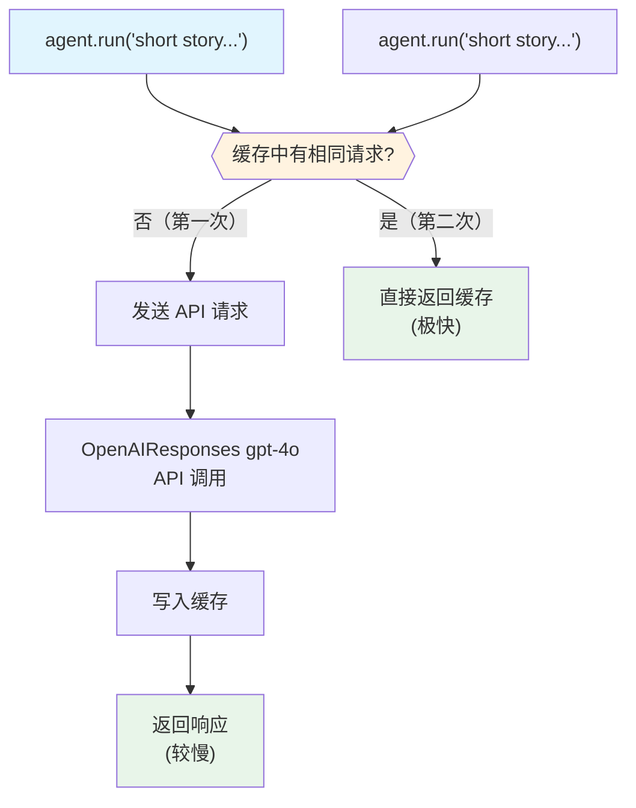

# cache_model_response.py — 实现原理分析

> 源文件：`cookbook/02_agents/14_advanced/cache_model_response.py`

## 概述

本示例展示 Agno 的 **模型响应缓存**机制：通过 `OpenAIResponses(cache_response=True)` 开启响应缓存，相同输入的第二次请求直接返回缓存结果，避免重复 API 调用，`metrics.duration` 显示显著时间差异。

**核心配置一览：**

| 配置项 | 值 | 说明 |
|--------|------|------|
| `model` | `OpenAIResponses(id="gpt-4o", cache_response=True)` | 启用响应缓存 |
| `instructions` | `None` | 未设置 |
| `tools` | `None` | 未设置 |

## 核心组件解析

### cache_response 配置

```python
agent = Agent(
    model=OpenAIResponses(
        id="gpt-4o",
        cache_response=True,  # 在模型层启用缓存
    )
)

# 第一次请求：缓存 MISS → 发送 API 请求
response = agent.run("Write me a short story about a cat that can talk.")
print(f"Elapsed: {response.metrics.duration:.3f}s")  # 较慢（API 调用）

time.sleep(0.5)

# 第二次请求（相同输入）：缓存 HIT → 直接返回
response = agent.run("Write me a short story about a cat that can talk.")
print(f"Elapsed: {response.metrics.duration:.3f}s")  # 极快（缓存命中）
```

### 缓存机制说明

`cache_response=True` 由 `OpenAIResponses` 模型层处理：
- **缓存 MISS**：正常发送 API 请求，响应存入缓存
- **缓存 HIT**：相同请求（相同输入消息 hash）直接返回缓存结果
- **缓存范围**：通常是进程内缓存（非持久化）

缓存键基于：请求消息内容 + 模型 ID + 关键参数（temperature 等）

## System Prompt 组装

```text
（空）
```

## Mermaid 流程图



## 关键源码文件索引

| 文件 | 关键函数/类 | 作用 |
|------|------------|------|
| `agno/models/openai/responses.py` | `OpenAIResponses(cache_response=True)` | 响应缓存配置 |
| `agno/run/agent.py` | `RunOutput.metrics.duration` | 耗时 metrics |
