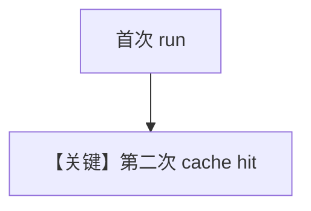

# cache_model_response.py — 实现原理分析

> 源文件：`cookbook/02_agents/14_advanced/cache_model_response.py`

## 概述

本示例展示 **`cache_response=True`**：同一提示连续 `run` 两次，第二次命中缓存，`metrics.duration` 显著下降（脚本打印对比）。

**核心配置：** `Agent(model=OpenAIResponses(id="gpt-4o", cache_response=True))`。

## 运行机制与因果链

缓存键依赖 **模型 id + 消息** 等（实现见 Model/Agent）；减少重复计费。

## Mermaid 流程图

```mermaid
flowchart TD
    R1["首次 run"] --> R2["【关键】第二次 cache hit"]
```

## 关键源码文件索引

| 文件 | 作用 |
|------|------|
| `agno/models/base.py` | 响应缓存逻辑 |
