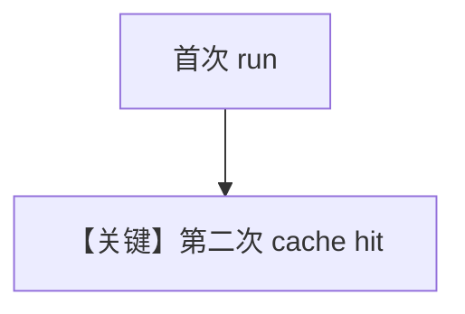

# cache_model_response.py — 实现原理分析

<!-- cookbook-py-source:start -->
## 完整源码

```python
"""
Cache Model Response
=============================

Example showing how to cache model responses to avoid redundant API calls.
"""

import time

from agno.agent import Agent
from agno.models.openai import OpenAIResponses

# ---------------------------------------------------------------------------
# Create Agent
# ---------------------------------------------------------------------------
agent = Agent(model=OpenAIResponses(id="gpt-4o", cache_response=True))

# ---------------------------------------------------------------------------
# Run Agent
# ---------------------------------------------------------------------------
if __name__ == "__main__":
    # Run the same query twice to demonstrate caching
    for i in range(1, 3):
        print(f"\n{'=' * 60}")
        print(
            f"Run {i}: {'Cache Miss (First Request)' if i == 1 else 'Cache Hit (Cached Response)'}"
        )
        print(f"{'=' * 60}\n")

        response = agent.run(
            "Write me a short story about a cat that can talk and solve problems."
        )
        print(response.content)
        print(f"\n Elapsed time: {response.metrics.duration:.3f}s")

        # Small delay between iterations for clarity
        if i == 1:
            time.sleep(0.5)
```

<!-- cookbook-py-source:end -->

> 源文件：`cookbook/02_agents/14_advanced/cache_model_response.py`

## 概述

本示例展示 **`cache_response=True`**：同一提示连续 `run` 两次，第二次命中缓存，`metrics.duration` 显著下降（脚本打印对比）。

**核心配置：** `Agent(model=OpenAIResponses(id="gpt-4o", cache_response=True))`。

## 运行机制与因果链

缓存键依赖 **模型 id + 消息** 等（实现见 Model/Agent）；减少重复计费。

## Mermaid 流程图


```mermaid
flowchart TD
    R1["首次 run"] --> R2["【关键】第二次 cache hit"]
```

## 关键源码文件索引

| 文件 | 作用 |
|------|------|
| `agno/models/base.py` | 响应缓存逻辑 |
