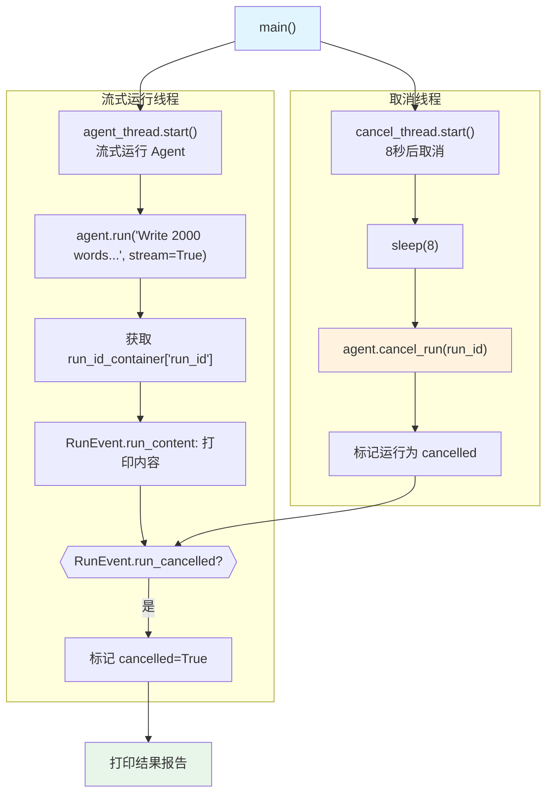

# cancel_run.py — 实现原理分析

> 源文件：`cookbook/02_agents/14_advanced/cancel_run.py`

## 概述

本示例展示 Agno 的 **同步流式运行取消**机制：通过多线程，一个线程流式运行 Agent（等待 `run_id` 出现），另一个线程延迟后调用 `agent.cancel_run(run_id)`，流式迭代中检测到 `RunEvent.run_cancelled` 事件后中断。

**核心配置一览：**

| 配置项 | 值 | 说明 |
|--------|------|------|
| `name` | `"StorytellerAgent"` | Agent 名称 |
| `model` | `OpenAIResponses(id="gpt-5-mini")` | Responses API |
| `description` | `"An agent that writes detailed stories"` | 描述 |

## 核心组件解析

### 多线程取消模式

```python
run_id_container = {}  # 线程间共享容器

# 线程1：流式运行，获取 run_id
def long_running_task(agent, run_id_container):
    for chunk in agent.run("Write 2000 words...", stream=True):
        # 从第一个 chunk 获取 run_id
        if "run_id" not in run_id_container and chunk.run_id:
            run_id_container["run_id"] = chunk.run_id

        if chunk.event == RunEvent.run_content:
            print(chunk.content, end="", flush=True)
        elif chunk.event == RunEvent.run_cancelled:
            # 检测到取消事件
            print(f"\n[CANCELLED] Run was cancelled")
            run_id_container["result"] = {"status": "cancelled", ...}
            return

# 线程2：延迟后取消
def cancel_after_delay(agent, run_id_container, delay_seconds=8):
    time.sleep(delay_seconds)
    run_id = run_id_container.get("run_id")
    if run_id:
        success = agent.cancel_run(run_id)  # 标记为取消

# 启动两个线程
agent_thread = threading.Thread(target=lambda: long_running_task(agent, run_id_container))
cancel_thread = threading.Thread(target=cancel_after_delay, args=(agent, run_id_container, 8))
agent_thread.start()
cancel_thread.start()
agent_thread.join()
cancel_thread.join()
```

### RunEvent.run_cancelled 事件

当 `agent.cancel_run(run_id)` 被调用后，正在运行的流式循环会在下一个检查点检测到取消信号，并发出 `RunEvent.run_cancelled` 事件，迭代停止。

### 取消结果检验

```python
result = run_id_container.get("result")
if result["cancelled"]:
    print("[SUCCESS] Run was successfully cancelled!")
```

## System Prompt 组装

| 序号 | 组成部分 | 值 | 是否生效 |
|------|---------|-----|---------|
| 3.2.4 | `add_name_to_context` | "StorytellerAgent" | 是 |
| 3.3.1 | `description` | "An agent that writes detailed stories" | 是 |

```text
Your name is: StorytellerAgent

An agent that writes detailed stories
```

## Mermaid 流程图



## 关键源码文件索引

| 文件 | 关键函数/类 | 作用 |
|------|------------|------|
| `agno/agent/agent.py` | `cancel_run(run_id)` | 同步取消 |
| `agno/run/agent.py` | `RunEvent.run_cancelled` | 取消事件 |
| `agno/run/base.py` | `RunStatus.cancelled` | 取消状态 |
