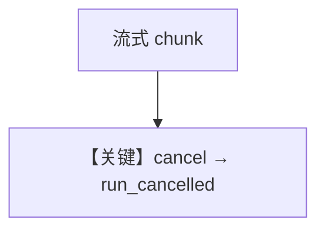

# cancel_run.py — 实现原理分析

> 源文件：`cookbook/02_agents/14_advanced/cancel_run.py`

## 概述

本示例展示 **流式长文生成中取消**：`agent.run(..., stream=True)` 迭代 chunk，另一线程 **`cancel_run(run_id)`**（以脚本实际 API 为准），收到 **`RunEvent.run_cancelled`** 结束。

**核心配置：** `OpenAIResponses`；长 prompt 逼出多 token。

## 运行机制与因果链

协作：**生产者**流式消费，**消费者**触发取消；需有效 `run_id`（从首 chunk 捕获）。

## Mermaid 流程图

```mermaid
flowchart TD
    S["流式 chunk"] --> X["【关键】cancel → run_cancelled"]
```

## 关键源码文件索引

| 文件 | 作用 |
|------|------|
| `agno/agent` | `cancel_run` |
| `agno/run` | `RunEvent.run_cancelled` |
