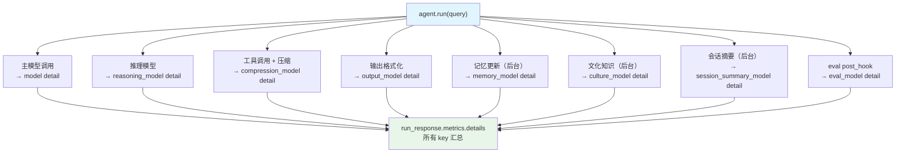

# combined_metrics.py — 实现原理分析

> 源文件：`cookbook/02_agents/14_advanced/combined_metrics.py`

## 概述

本示例展示当 Agent 同时启用多个后台功能时，`metrics.details` 中各自独立的 **detail key** 结构：`model`、`reasoning_model`、`compression_model`、`output_model`、`memory_model`、`culture_model`、`session_summary_model`、`eval_model`。

**核心配置一览：**

| 配置项 | 值 | 说明 |
|--------|------|------|
| `model` | `OpenAIChat(gpt-4o-mini)` | 主模型 |
| `reasoning_model` | `OpenAIChat(gpt-4o-mini)` | 推理子模型 |
| `reasoning` | `True` | 启用推理 |
| `compression_manager` | `CompressionManager(...)` | 压缩管理器 |
| `output_model` | `OpenAIChat(gpt-4o-mini)` | 输出格式化模型 |
| `output_schema` | `StockSummary` | Pydantic 结构化输出 |
| `memory_manager` | `MemoryManager(...)` | 记忆管理器 |
| `update_memory_on_run` | `True` | 每次运行后更新记忆 |
| `culture_manager` | `CultureManager(...)` | 文化知识管理器 |
| `update_cultural_knowledge` | `True` | 自动提取文化知识 |
| `session_summary_manager` | `SessionSummaryManager(...)` | 会话摘要管理器 |
| `enable_session_summaries` | `True` | 启用会话摘要 |
| `post_hooks` | `[AgentAsJudgeEval(...)]` | 评估钩子（eval_model） |
| `db` | `PostgresDb` | 持久化存储 |

## metrics.details 键索引

| key | 来源 | 说明 |
|-----|------|------|
| `model` | 主 Agent 自身的 LLM 调用 | 主要推理 token 消耗 |
| `reasoning_model` | `reasoning_model` 的调用 | 推理步骤消耗 |
| `compression_model` | `CompressionManager` | 工具结果压缩消耗 |
| `output_model` | `output_model` 的结构化输出调用 | 格式化输出消耗 |
| `memory_model` | `MemoryManager` | 记忆提取/更新消耗 |
| `culture_model` | `CultureManager` | 文化知识提取消耗 |
| `session_summary_model` | `SessionSummaryManager` | 会话摘要生成消耗 |
| `eval_model` | `AgentAsJudgeEval` post_hook | 质量评估消耗 |

## 核心代码模式

```python
run_response = agent.run("Get the stock price and company info for NVDA...")

# 查看所有 detail keys
for model_type, model_metrics_list in run_response.metrics.details.items():
    print(f"\n{model_type}:")  # "model", "memory_model", "culture_model", ...
    for model_metric in model_metrics_list:
        pprint(model_metric)

# 会话级聚合 metrics
session_metrics = agent.get_session_metrics()
```

## Mermaid 流程图



## 关键源码文件索引

| 文件 | 关键函数/类 | 作用 |
|------|------------|------|
| `agno/run/agent.py` | `RunMetrics.details` | metrics detail key 存储 |
| `agno/eval/agent_as_judge.py` | `AgentAsJudgeEval` | eval_model 消耗追踪 |
| `agno/agent/agent.py` | `get_session_metrics()` | 会话聚合 metrics |
