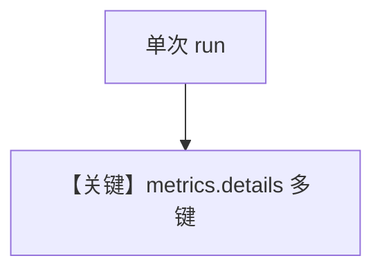

# combined_metrics.py — 实现原理分析

<!-- cookbook-py-source:start -->
## 完整源码

```python
"""
Combined Metrics
=============================

When an agent uses multiple background features, each model's
calls are tracked under separate detail keys:
- "model" for the agent's own calls
- "reasoning_model" for reasoning manager calls
- "compression_model" for compression manager calls
- "output_model" for output model calls
- "memory_model" for memory manager calls
- "culture_model" for culture manager calls
- "session_summary_model" for session summary calls
- "eval_model" for evaluation hook calls

This example shows all detail keys and session-level metrics.
"""

from typing import List

from agno.agent import Agent
from agno.compression.manager import CompressionManager
from agno.culture.manager import CultureManager
from agno.db.postgres import PostgresDb
from agno.eval.agent_as_judge import AgentAsJudgeEval
from agno.memory.manager import MemoryManager
from agno.models.openai import OpenAIChat
from agno.session.summary import SessionSummaryManager
from agno.tools.yfinance import YFinanceTools
from pydantic import BaseModel, Field
from rich.pretty import pprint


class StockSummary(BaseModel):
    ticker: str = Field(..., description="Stock ticker symbol")
    summary: str = Field(..., description="Brief summary of the stock")
    key_metrics: List[str] = Field(..., description="Key financial metrics")


# ---------------------------------------------------------------------------
# Create Agent
# ---------------------------------------------------------------------------
db = PostgresDb(db_url="postgresql+psycopg://ai:ai@localhost:5532/ai")

eval_hook = AgentAsJudgeEval(
    name="Quality Check",
    model=OpenAIChat(id="gpt-4o-mini"),
    criteria="Response should be helpful and accurate",
    scoring_strategy="binary",
)

agent = Agent(
    model=OpenAIChat(id="gpt-4o-mini"),
    tools=[YFinanceTools(enable_stock_price=True, enable_company_info=True)],
    reasoning_model=OpenAIChat(id="gpt-4o-mini"),
    reasoning=True,
    compression_manager=CompressionManager(
        model=OpenAIChat(id="gpt-4o-mini"),
        compress_tool_results_limit=1,
    ),
    output_model=OpenAIChat(id="gpt-4o-mini"),
    output_schema=StockSummary,
    structured_outputs=True,
    memory_manager=MemoryManager(model=OpenAIChat(id="gpt-4o-mini"), db=db),
    update_memory_on_run=True,
    culture_manager=CultureManager(model=OpenAIChat(id="gpt-4o-mini"), db=db),
    update_cultural_knowledge=True,
    session_summary_manager=SessionSummaryManager(model=OpenAIChat(id="gpt-4o-mini")),
    enable_session_summaries=True,
    post_hooks=[eval_hook],
    db=db,
    session_id="combined-metrics-demo",
)

# ---------------------------------------------------------------------------
# Run Agent
# ---------------------------------------------------------------------------
if __name__ == "__main__":
    run_response = agent.run(
        "Get the stock price and company info for NVDA and summarize it."
    )

    print("=" * 50)
    print("RUN METRICS")
    print("=" * 50)
    pprint(run_response.metrics)

    print("=" * 50)
    print("MODEL DETAILS")
    print("=" * 50)
    if run_response.metrics and run_response.metrics.details:
        for model_type, model_metrics_list in run_response.metrics.details.items():
            print(f"\n{model_type}:")
            for model_metric in model_metrics_list:
                pprint(model_metric)

    print("=" * 50)
    print("SESSION METRICS")
    print("=" * 50)
    session_metrics = agent.get_session_metrics()
    if session_metrics:
        pprint(session_metrics)
```

<!-- cookbook-py-source:end -->

> 源文件：`cookbook/02_agents/14_advanced/combined_metrics.py`

## 概述

本示例展示 **`metrics.details` 多子模型键**：同一 run 中主 `model`、`reasoning_model`、`compression_model`、`memory_model`、`culture_model`、`session_summary_model`、`eval_model` 等各自累计（脚本顶部注释列全键）；组合 `CompressionManager`、`MemoryManager`、`CultureManager`、`SessionSummaryManager`、`AgentAsJudgeEval`、`reasoning_model`、`output_schema` 等。

**核心配置：** `PostgresDb`；`YFinanceTools`；多子系统全开。

## 运行机制与因果链

用于 **成本归因**：一眼区分主回答 vs 辅助模型调用。

## Mermaid 流程图


```mermaid
flowchart TD
    R["单次 run"] --> D["【关键】metrics.details 多键"]
```

## 关键源码文件索引

| 文件 | 作用 |
|------|------|
| `agno/models/metrics.py` | `details` 字典结构 |
