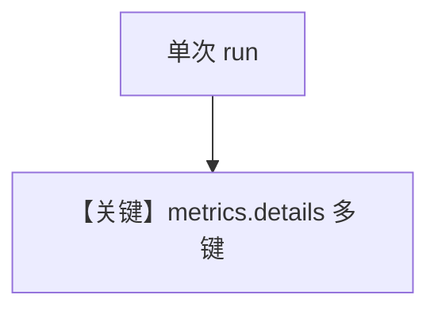

# combined_metrics.py — 实现原理分析

> 源文件：`cookbook/02_agents/14_advanced/combined_metrics.py`

## 概述

本示例展示 **`metrics.details` 多子模型键**：同一 run 中主 `model`、`reasoning_model`、`compression_model`、`memory_model`、`culture_model`、`session_summary_model`、`eval_model` 等各自累计（脚本顶部注释列全键）；组合 `CompressionManager`、`MemoryManager`、`CultureManager`、`SessionSummaryManager`、`AgentAsJudgeEval`、`reasoning_model`、`output_schema` 等。

**核心配置：** `PostgresDb`；`YFinanceTools`；多子系统全开。

## 运行机制与因果链

用于 **成本归因**：一眼区分主回答 vs 辅助模型调用。

## Mermaid 流程图

```mermaid
flowchart TD
    R["单次 run"] --> D["【关键】metrics.details 多键"]
```

## 关键源码文件索引

| 文件 | 作用 |
|------|------|
| `agno/models/metrics.py` | `details` 字典结构 |
