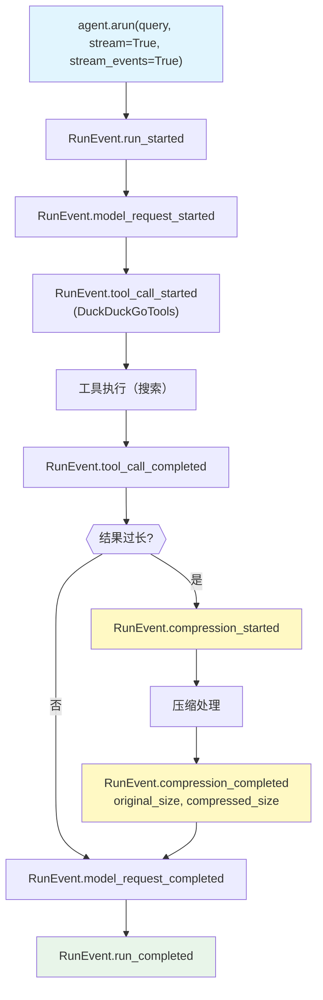

# compression_events.py — 实现原理分析

> 源文件：`cookbook/02_agents/14_advanced/compression_events.py`

## 概述

本示例展示 **压缩事件**（CompressionEvents）的流式监控：通过 `stream_events=True` + `compress_tool_results=True`，在 `RunOutputEvent` 流中捕获 `RunEvent.compression_started` 和 `RunEvent.compression_completed`，实时追踪压缩前后的字符数量和压缩率。

**核心配置一览：**

| 配置项 | 值 | 说明 |
|--------|------|------|
| `model` | `OpenAIResponses(gpt-5-mini)` | Responses API |
| `tools` | `[DuckDuckGoTools()]` | 搜索工具 |
| `compress_tool_results` | `True` | 启用工具结果压缩 |
| `description` | 竞争对手追踪 | 定义角色 |

## 核心事件监控模式

```python
async for chunk in agent.arun(query, stream=True, stream_events=True):
    if chunk.event == RunEvent.run_started.value:
        print(f"[RunStarted] model={chunk.model}")

    elif chunk.event == RunEvent.model_request_started.value:
        print(f"[ModelRequestStarted] model={chunk.model}")

    elif chunk.event == RunEvent.model_request_completed.value:
        print(f"[ModelRequestCompleted] tokens: in={chunk.input_tokens}, out={chunk.output_tokens}")

    elif chunk.event == RunEvent.tool_call_started.value:
        print(f"[ToolCallStarted] {chunk.tool.tool_name}")

    elif chunk.event == RunEvent.tool_call_completed.value:
        print(f"[ToolCallCompleted] {chunk.tool.tool_name}")

    elif chunk.event == RunEvent.compression_started.value:
        print("[CompressionStarted]")

    elif chunk.event == RunEvent.compression_completed.value:
        # 压缩率计算
        ratio = (1 - chunk.compressed_size / chunk.original_size) * 100
        print(f"[CompressionCompleted] {chunk.original_size} -> {chunk.compressed_size} ({ratio:.1f}% 减少)")
```

## RunOutputEvent 压缩字段

| 字段 | 事件 | 说明 |
|------|------|------|
| `tool_results_compressed` | `compression_completed` | 被压缩的工具结果数量 |
| `original_size` | `compression_completed` | 压缩前字符总数 |
| `compressed_size` | `compression_completed` | 压缩后字符总数 |

## compress_tool_results 工作机制

```
工具调用完成
    ↓
token 数超过阈值?
    ↓ 是
触发 CompressionStarted 事件
    ↓
内置压缩模型（或 CompressionManager）对工具结果摘要
    ↓
触发 CompressionCompleted 事件（含 original_size, compressed_size）
    ↓
摘要结果送入下一轮模型调用
```

## Mermaid 流程图



## 关键源码文件索引

| 文件 | 关键函数/类 | 作用 |
|------|------------|------|
| `agno/run/agent.py` | `RunEvent.compression_started/completed` | 压缩事件枚举 |
| `agno/run/agent.py` | `RunOutputEvent` | 压缩字段定义 |
| `agno/compression/manager.py` | `CompressionManager` | 压缩逻辑 |
