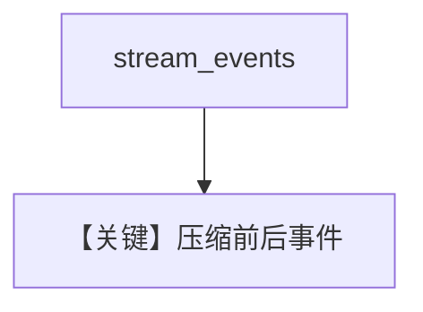

# compression_events.py — 实现原理分析

> 源文件：`cookbook/02_agents/14_advanced/compression_events.py`

## 概述

本示例展示 **`compress_tool_results=True` 时的事件流**：`stream_events=True` 监听 `RunEvent`（含压缩相关，见脚本 elif 分支），`DuckDuckGoTools` 检索后触发压缩管线。

**核心配置：** `OpenAIResponses`；竞争情报类 `description`/`instructions`。

## 运行机制与因果链

验证压缩不仅改消息，还发 **可订阅事件** 便于调试。

## Mermaid 流程图

```mermaid
flowchart TD
    EV["stream_events"] --> C["【关键】压缩前后事件"]
```

## 关键源码文件索引

| 文件 | 作用 |
|------|------|
| `agno/run/agent.py` | `RunEvent` 与压缩钩子 |
