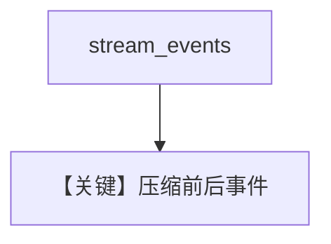

# compression_events.py — 实现原理分析

<!-- cookbook-py-source:start -->
## 完整源码

```python
"""
Compression Events
=============================

Test script to verify compression events are working correctly.
"""

import asyncio

from agno.agent import Agent
from agno.models.openai import OpenAIResponses
from agno.run.agent import RunEvent
from agno.tools.duckduckgo import DuckDuckGoTools

# ---------------------------------------------------------------------------
# Create Agent
# ---------------------------------------------------------------------------
agent = Agent(
    model=OpenAIResponses(id="gpt-5-mini"),
    tools=[DuckDuckGoTools()],
    description="Specialized in tracking competitor activities",
    instructions="Use the search tools and always use the latest information and data.",
    compress_tool_results=True,
)


async def main():
    print("--- Running agent with compression events ---")

    stream = agent.arun(
        """
        Research recent activities for these AI companies:
        1. OpenAI - latest news
        2. Anthropic - latest news
        3. Google DeepMind - latest news
        """,
        stream=True,
        stream_events=True,
    )

    async for chunk in stream:
        if chunk.event == RunEvent.run_started.value:
            print(f"[RunStarted] model={chunk.model}")

        elif chunk.event == RunEvent.model_request_started.value:
            print(f"[ModelRequestStarted] model={chunk.model}")

        elif chunk.event == RunEvent.model_request_completed.value:
            print(
                f"[ModelRequestCompleted] tokens: in={chunk.input_tokens}, out={chunk.output_tokens}"
            )

        elif chunk.event == RunEvent.tool_call_started.value:
            print(f"[ToolCallStarted] {chunk.tool.tool_name}")

        elif chunk.event == RunEvent.tool_call_completed.value:
            print(f"[ToolCallCompleted] {chunk.tool.tool_name}")

        elif chunk.event == RunEvent.compression_started.value:
            print("[CompressionStarted]")

        elif chunk.event == RunEvent.compression_completed.value:
            print(
                f"[CompressionCompleted] compressed={chunk.tool_results_compressed} results"
            )
            print(
                f"  Original: {chunk.original_size} chars -> Compressed: {chunk.compressed_size} chars"
            )
            if chunk.original_size and chunk.compressed_size:
                ratio = (1 - chunk.compressed_size / chunk.original_size) * 100
                print(f"  Compression ratio: {ratio:.1f}% reduction")

        elif chunk.event == RunEvent.run_completed.value:
            print("[RunCompleted]")


# ---------------------------------------------------------------------------
# Run Agent
# ---------------------------------------------------------------------------
if __name__ == "__main__":
    asyncio.run(main())
```

<!-- cookbook-py-source:end -->

> 源文件：`cookbook/02_agents/14_advanced/compression_events.py`

## 概述

本示例展示 **`compress_tool_results=True` 时的事件流**：`stream_events=True` 监听 `RunEvent`（含压缩相关，见脚本 elif 分支），`DuckDuckGoTools` 检索后触发压缩管线。

**核心配置：** `OpenAIResponses`；竞争情报类 `description`/`instructions`。

## 运行机制与因果链

验证压缩不仅改消息，还发 **可订阅事件** 便于调试。

## Mermaid 流程图


```mermaid
flowchart TD
    EV["stream_events"] --> C["【关键】压缩前后事件"]
```

## 关键源码文件索引

| 文件 | 作用 |
|------|------|
| `agno/run/agent.py` | `RunEvent` 与压缩钩子 |
