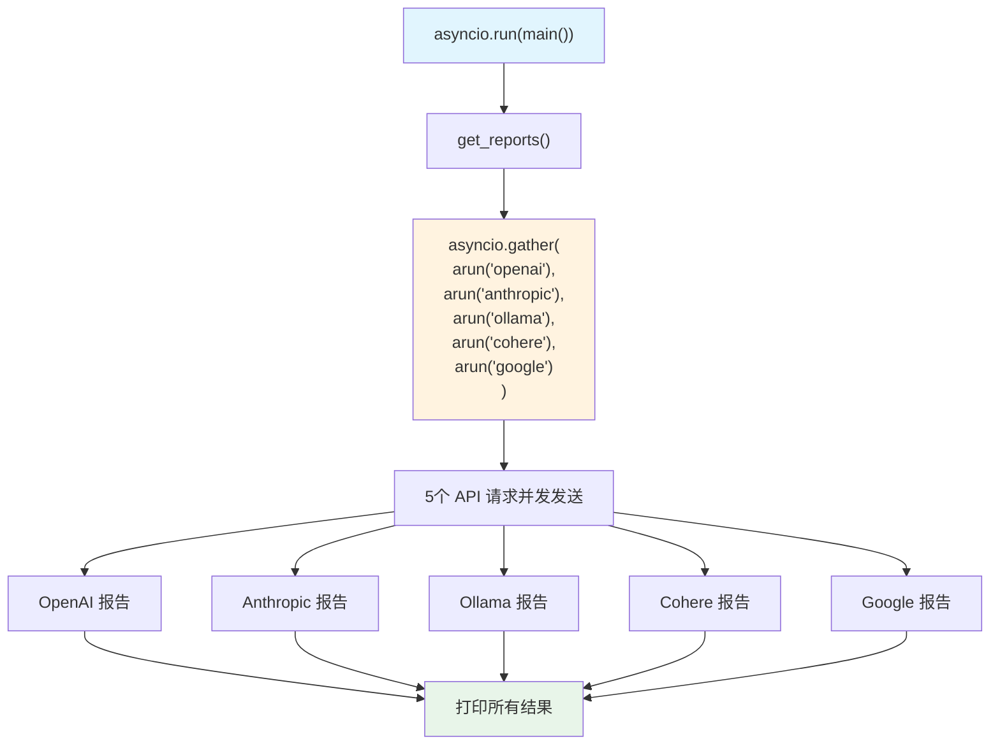

# concurrent_execution.py — 实现原理分析

> 源文件：`cookbook/02_agents/14_advanced/concurrent_execution.py`

## 概述

本示例展示 **并发 Agent 执行**模式：使用 `asyncio.gather` 并发调用同一个 Agent 实例的多个 `arun()` 任务，对5个 AI 供应商同时进行研究报告，而非串行逐个调用。

**核心配置一览：**

| 配置项 | 值 | 说明 |
|--------|------|------|
| `model` | `OpenAIResponses(gpt-5-mini)` | Responses API |
| `tools` | `[DuckDuckGoTools()]` | 搜索工具 |
| `instructions` | 写无偏报告 | 指令 |

## 核心模式：单实例并发

```python
# Agent 在循环外创建一次，供所有并发任务复用
agent = Agent(
    model=OpenAIResponses(id="gpt-5-mini"),
    instructions=instructions,
    tools=[DuckDuckGoTools()],
)

async def get_reports():
    tasks = [
        agent.arun(f"Write a report on the following AI provider: {provider}")
        for provider in providers  # ["openai", "anthropic", "ollama", "cohere", "google"]
    ]
    results = await asyncio.gather(*tasks)  # 并发执行，5个请求同时发出
    return results
```

**关键规则：**
- Agent 在循环外创建一次（`agent = Agent(...)`），不在列表推导中创建
- `asyncio.gather(*tasks)` 并发调度所有 coroutines
- 每个 `arun()` 调用有独立的 `run_id` 和状态，互不干扰

## 串行 vs 并发对比

| 模式 | 代码 | 耗时（5个任务）|
|------|------|-------------|
| 串行 | `for p in providers: await agent.arun(p)` | ~5× 单次耗时 |
| 并发 | `asyncio.gather(*[agent.arun(p) for p in providers])` | ~1× 单次耗时 |

## System Prompt 组装

```text
Your task is to write a well researched report on AI providers.
The report should be unbiased and factual.
```

## Mermaid 流程图



## 关键源码文件索引

| 文件 | 关键函数/类 | 作用 |
|------|------------|------|
| `agno/agent/agent.py` | `arun()` | 异步运行，支持并发 |
