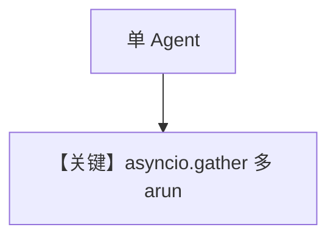

# concurrent_execution.py — 实现原理分析

> 源文件：`cookbook/02_agents/14_advanced/concurrent_execution.py`

## 概述

本示例展示 **单 Agent 实例并发 `arun`**：`asyncio.gather` 对多 provider 并行写报告，**在循环外创建一次 Agent**（注释强调正确模式）。

**核心配置：** `DuckDuckGoTools`；`instructions` 多行字面量。

## 运行机制与因果链

并发 run **共享同一 Agent 配置**，避免每任务重建开销；注意 **会话隔离**（若共享 session_id 可能串历史，本示例未设 session）。

## Mermaid 流程图

```mermaid
flowchart TD
    A["单 Agent"] --> G["【关键】asyncio.gather 多 arun"]
```

## 关键源码文件索引

| 文件 | 作用 |
|------|------|
| `agno/agent` | 异步 `arun` |
