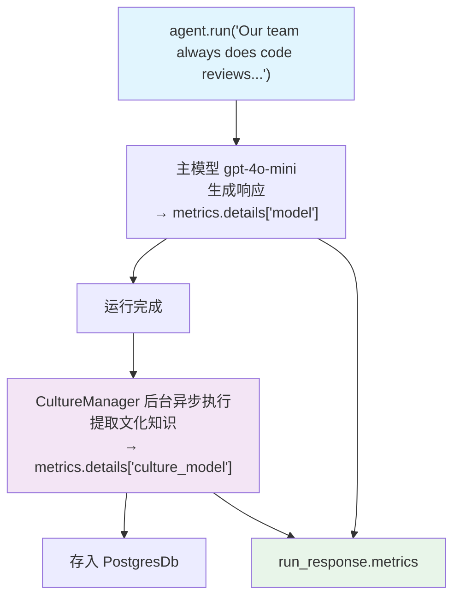

# culture_metrics.py — 实现原理分析

> 源文件：`cookbook/02_agents/14_advanced/culture_metrics.py`

## 概述

本示例展示 **CultureManager 的 metrics 追踪**：当 Agent 配置 `culture_manager` 和 `update_cultural_knowledge=True` 时，CultureManager 的 LLM 调用会被记录在 `run_response.metrics.details["culture_model"]` 下，可与主模型消耗分开分析。

**核心配置一览：**

| 配置项 | 值 | 说明 |
|--------|------|------|
| `model` | `OpenAIChat(gpt-4o-mini)` | 主模型 |
| `culture_manager` | `CultureManager(model=gpt-4o-mini, db=PostgresDb)` | 文化知识管理 |
| `update_cultural_knowledge` | `True` | 每次运行后更新文化知识 |
| `db` | `PostgresDb` | 持久化存储 |

## 核心代码模式

```python
run_response = agent.run(
    "Our team always does code reviews before merging. We pair program on complex features."
)

# 主模型 metrics
pprint(run_response.metrics)

# 分模型 detail keys
for model_type, model_metrics_list in run_response.metrics.details.items():
    print(f"\n{model_type}:")  # "model" 和 "culture_model"
    for model_metric in model_metrics_list:
        pprint(model_metric)
```

## metrics.details 键说明

| key | 来源 | 说明 |
|-----|------|------|
| `model` | 主 Agent gpt-4o-mini 调用 | 对用户消息的主要响应 |
| `culture_model` | CultureManager gpt-4o-mini 调用 | 后台提取文化知识的 LLM 消耗 |

CultureManager 在 Agent run 完成**后在后台异步**调用 LLM，将对话中的团队习惯/规范等内容提取为 `CulturalKnowledge` 对象并存入 DB。

## Mermaid 流程图



## 关键源码文件索引

| 文件 | 关键函数/类 | 作用 |
|------|------------|------|
| `agno/culture/manager.py` | `CultureManager` | 文化知识提取 |
| `agno/run/agent.py` | `RunMetrics.details["culture_model"]` | 文化模型 metrics |
| `agno/agent/_managers.py` | `start_cultural_future()` | 后台异步启动文化更新 |
