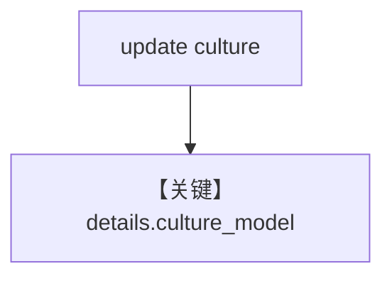

# culture_metrics.py — 实现原理分析

> 源文件：`cookbook/02_agents/14_advanced/culture_metrics.py`

## 概述

本示例展示 **文化管理器调用的 metrics 分键**：`culture_manager` + `update_cultural_knowledge=True`，打印 `run_response.metrics` 与 `metrics.details["culture_model"]`。

**核心配置：** `PostgresDb`；双 `OpenAIChat`。

## 运行机制与因果链

文化更新走 **独立模型调用**，与主答分开计量。

## Mermaid 流程图

```mermaid
flowchart TD
    U["update culture"] --> M["【关键】details.culture_model"]
```

## 关键源码文件索引

| 文件 | 作用 |
|------|------|
| `agno/culture/manager.py` | 内部模型调用 |
