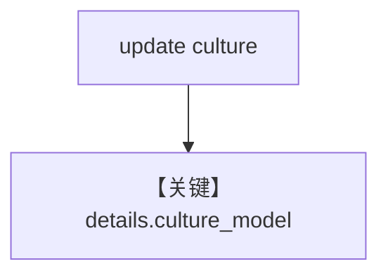

# culture_metrics.py — 实现原理分析

<!-- cookbook-py-source:start -->
## 完整源码

```python
"""
Culture Manager Metrics
=============================

When an agent uses a CultureManager, the culture model's
calls are tracked under the "culture_model" detail key.
"""

from agno.agent import Agent
from agno.culture.manager import CultureManager
from agno.db.postgres import PostgresDb
from agno.models.openai import OpenAIChat
from rich.pretty import pprint

# ---------------------------------------------------------------------------
# Create Agent
# ---------------------------------------------------------------------------
db = PostgresDb(db_url="postgresql+psycopg://ai:ai@localhost:5532/ai")

agent = Agent(
    model=OpenAIChat(id="gpt-4o-mini"),
    culture_manager=CultureManager(model=OpenAIChat(id="gpt-4o-mini"), db=db),
    update_cultural_knowledge=True,
    db=db,
)

# ---------------------------------------------------------------------------
# Run Agent
# ---------------------------------------------------------------------------
if __name__ == "__main__":
    run_response = agent.run(
        "Our team always does code reviews before merging. We pair program on complex features."
    )

    print("=" * 50)
    print("RUN METRICS")
    print("=" * 50)
    pprint(run_response.metrics)

    print("=" * 50)
    print("MODEL DETAILS")
    print("=" * 50)
    if run_response.metrics and run_response.metrics.details:
        for model_type, model_metrics_list in run_response.metrics.details.items():
            print(f"\n{model_type}:")
            for model_metric in model_metrics_list:
                pprint(model_metric)
```

<!-- cookbook-py-source:end -->

> 源文件：`cookbook/02_agents/14_advanced/culture_metrics.py`

## 概述

本示例展示 **文化管理器调用的 metrics 分键**：`culture_manager` + `update_cultural_knowledge=True`，打印 `run_response.metrics` 与 `metrics.details["culture_model"]`。

**核心配置：** `PostgresDb`；双 `OpenAIChat`。

## 运行机制与因果链

文化更新走 **独立模型调用**，与主答分开计量。

## Mermaid 流程图


```mermaid
flowchart TD
    U["update culture"] --> M["【关键】details.culture_model"]
```

## 关键源码文件索引

| 文件 | 作用 |
|------|------|
| `agno/culture/manager.py` | 内部模型调用 |
