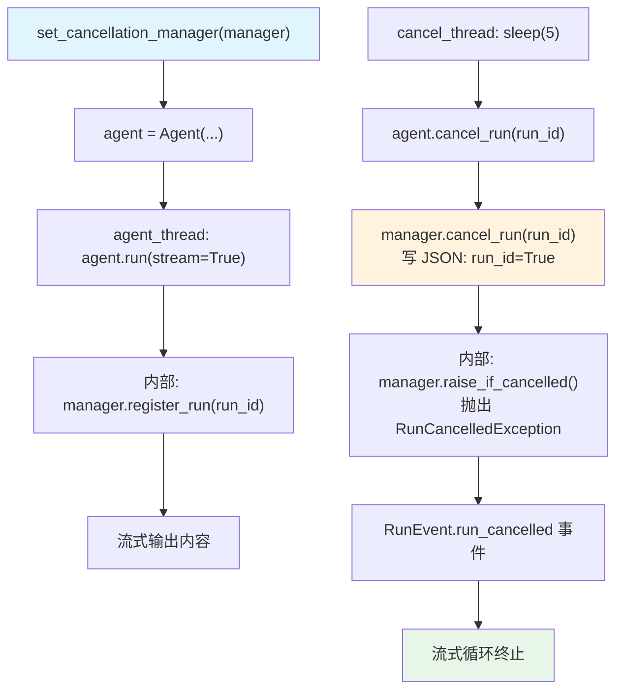

# custom_cancellation_manager.py — 实现原理分析

> 源文件：`cookbook/02_agents/14_advanced/custom_cancellation_manager.py`

## 概述

本示例展示如何通过继承 `BaseRunCancellationManager` 实现**自定义取消管理器**，将取消状态持久化到 JSON 文件，可扩展为数据库、Redis 或消息队列等后端，并通过 `set_cancellation_manager()` 全局注册。

**核心配置一览：**

| 配置项 | 值 | 说明 |
|--------|------|------|
| `name` | `"StoryAgent"` | Agent 名称 |
| `model` | `OpenAIResponses(gpt-5-mini)` | Responses API |
| 取消管理器 | `FileBasedCancellationManager` | 自定义文件持久化 |

## 架构分层

```
agno 取消框架
┌──────────────────────────────────────────────────┐
│ BaseRunCancellationManager (抽象基类)              │
│   register_run(run_id)    / aregister_run()       │
│   cancel_run(run_id) -> bool / acancel_run()      │
│   is_cancelled(run_id) -> bool / ais_cancelled()  │
│   cleanup_run(run_id)    / acleanup_run()         │
│   raise_if_cancelled(run_id) / araise_if_cancelled│
│   get_active_runs()      / aget_active_runs()     │
└──────────────────────────────────────────────────┘
          ↑ 继承
┌──────────────────────────────────────────────────┐
│ FileBasedCancellationManager                      │
│   state: {run_id: bool} → JSON 文件               │
│   threading.Lock 保护并发写操作                    │
└──────────────────────────────────────────────────┘
```

## 核心代码模式

```python
class FileBasedCancellationManager(BaseRunCancellationManager):
    def register_run(self, run_id: str) -> None:
        with self._lock:
            state = self._read_state()
            state.setdefault(run_id, False)   # False = not cancelled
            self._write_state(state)

    def cancel_run(self, run_id: str) -> bool:
        with self._lock:
            state = self._read_state()
            was_registered = run_id in state
            state[run_id] = True              # True = cancelled
            self._write_state(state)
            return was_registered

    def is_cancelled(self, run_id: str) -> bool:
        return self._read_state().get(run_id, False)

    def raise_if_cancelled(self, run_id: str) -> None:
        if self.is_cancelled(run_id):
            raise RunCancelledException(f"Run {run_id} was cancelled")

# 全局注册自定义管理器（替换默认的内存管理器）
manager = FileBasedCancellationManager(file_path=state_file)
set_cancellation_manager(manager)

# 之后 agent.cancel_run(run_id) 会调用 manager.cancel_run(run_id)
```

## 关键设计细节

| 设计点 | 实现方式 | 说明 |
|--------|---------|------|
| 取消前注册 | `setdefault(run_id, False)` | 保留"先取消后注册"的意图 |
| 线程安全 | `threading.Lock` | 防止并发读写冲突 |
| 同步/异步 | `aXxx` 方法复用同步版本 | 简单场景的实现模式 |
| 状态清理 | `cleanup_run()` 删除条目 | 防止文件无限增长 |

## Mermaid 流程图



## 关键源码文件索引

| 文件 | 关键函数/类 | 作用 |
|------|------------|------|
| `agno/run/cancellation_management/base.py` | `BaseRunCancellationManager` | 抽象基类 |
| `agno/run/cancel.py` | `set_cancellation_manager()` | 全局注册入口 |
| `agno/exceptions.py` | `RunCancelledException` | 取消异常 |
