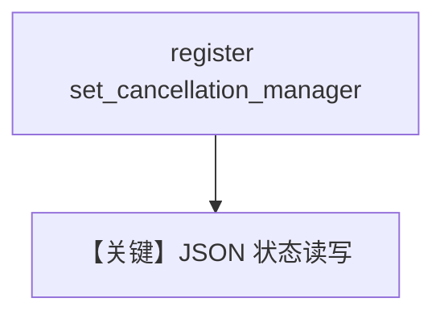

# custom_cancellation_manager.py — 实现原理分析

> 源文件：`cookbook/02_agents/14_advanced/custom_cancellation_manager.py`

## 概述

本示例展示 **自定义 `BaseRunCancellationManager`**：`FileBasedCancellationManager` 用 JSON 文件跨进程共享取消标志；`set_cancellation_manager(...)` 注册全局；流中取消抛出 `RunCancelledException`（见脚本）。

**核心配置：** `OpenAIResponses`；临时文件路径。

## 运行机制与因果链

默认内存管理器无法跨 worker；**文件/Redis** 可实现分布式 cancel。

## Mermaid 流程图

```mermaid
flowchart TD
    R["register set_cancellation_manager"] --> F["【关键】JSON 状态读写"]
```

## 关键源码文件索引

| 文件 | 作用 |
|------|------|
| `agno/run/cancellation_management/base.py` | `BaseRunCancellationManager` |
| `agno/run/cancel.py` | `set_cancellation_manager` |
