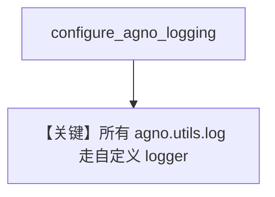

# custom_logging.py — 实现原理分析

<!-- cookbook-py-source:start -->
## 完整源码

```python
"""
Custom Logging
=============================

Example showing how to use a custom logger with Agno.
"""

import logging

from agno.agent import Agent
from agno.utils.log import configure_agno_logging, log_info


def get_custom_logger():
    """Return an example custom logger."""
    custom_logger = logging.getLogger("custom_logger")
    handler = logging.StreamHandler()
    formatter = logging.Formatter("[CUSTOM_LOGGER] %(levelname)s: %(message)s")
    handler.setFormatter(formatter)
    custom_logger.addHandler(handler)
    custom_logger.setLevel(logging.INFO)  # Set level to INFO to show info messages
    custom_logger.propagate = False
    return custom_logger


# Get the custom logger we will use for the example.
custom_logger = get_custom_logger()

# Configure Agno to use our custom logger. It will be used for all logging.
configure_agno_logging(custom_default_logger=custom_logger)

# Every use of the logging function in agno.utils.log will now use our custom logger.
log_info("This is using our custom logger!")

# Now let's setup an Agent and run it.
# All logging coming from the Agent will use our custom logger.
# ---------------------------------------------------------------------------
# Create Agent
# ---------------------------------------------------------------------------
agent = Agent()

# ---------------------------------------------------------------------------
# Run Agent
# ---------------------------------------------------------------------------
if __name__ == "__main__":
    agent.print_response("What can I do to improve my sleep?")
```

<!-- cookbook-py-source:end -->

> 源文件：`cookbook/02_agents/14_advanced/custom_logging.py`

## 概述

本示例展示 **`configure_agno_logging(custom_default_logger=...)`**：将标准 `logging.Logger` 注入 Agno 全局日志，`log_info` 与后续 `Agent` 运行走同一 handler。

**核心配置：** `Agent()` 无参（默认模型依环境）。

## 运行机制与因果链

统一 **可观测出口** 到 ELK/Splunk 等。

## Mermaid 流程图



## 关键源码文件索引

| 文件 | 作用 |
|------|------|
| `agno/utils/log.py` | `configure_agno_logging` |
